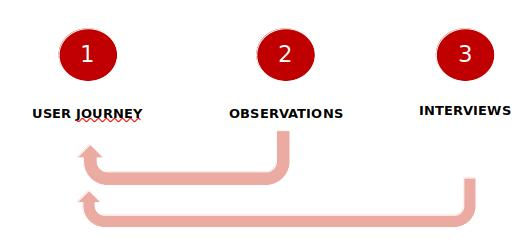

# 614-1 MANAGEMENT

## INFORMATION IMPORTANTES
chrystel.dayer@hesge.ch
LinkedIn: chrysteldayer

alexie.duarte-dasilva@hesge.ch

Examen :
- On peut avoir un cas comme SwissData SA et pouvoir répondre avec une réflexion, avec un processus.

## OBJECTIFS DU COURS
- connaître les techniques du management
- développer son leadership, sa communication et son propre style de management
- comprendre l'organisation d'une entreprise, les outils de décisions, la conduite du changement et les stratégies
- comprendre l'externalisation des entreprises
- introduction ITIL 4

- controle continu : 50%
  - challenge outsourcing : 40%
    - présentation orale et rapport - 01 & 03 juin 2022
  - présentation oral ITIL : 10%

- Challenging Outsourcing :
  - 1 rapport écrit (maximum 10 pages): Délai le 03.06.2022
  - 1 présentation orale de 20 minutes par équipe: 01.06.2022 / 03.06.2022

- examen final : 50%
  - individuel, oral
  - ensemble de la matière du semestre

# TABLE DES MATIERES
1. [Management](https://github.com/RiriJane/8th-sem-heg/blob/master/614-1_Management/614-1_Management.md#1-management)
2. [Délégation](https://github.com/RiriJane/8th-sem-heg/blob/master/614-1_Management/614-1_Management.md#2-d%C3%A9l%C3%A9gation)
3. [Innovation managériale](https://github.com/RiriJane/8th-sem-heg/blob/master/614-1_Management/614-1_Management.md#innovation-manag%C3%A9riale)
4. 

## PRESENTATION ITIL 4
- Former une équipe
- Réaliser une présentation orale sur une notion d’ITIL 4.
- Un exemple pratique d’utilisation d’ITIL 4 dans un contexte professionnel ou quotidien.
- La présentation peut être accompagnée d’un ppt (max 3 pages).
- Présentation créative «out of the box»
- Les équipes s’inscrivent pour leur présentation sur Cyberlearn

## QU'EST-CE QU'UN MANAGER ?

- manager : celui qui va s'occuper des tâches, plannifier les choses, controller, coordonner
- leadership : influencer, mentorat, guider l'équipe, apporter des idées de la créativité

- on peut etre un bon manager mais un mauvais leader et inverse
- bon manager + bon leader = jackpot car il va beaucoup apporter à son équipe. Mais il faut connaitre soi-même

#### STYLES DE MANAGEMENT
- on adapte selon l'environnement et de l'équipe :
  - l'équipe : analyser la compétence et motivation. Ces deux éléments peuvent montrer à quel point l'équipe est mature.
    - les compétences peuvent être acquérir et la motivation également
- l'agilité (axé compétence humaine) est très compliqué d'appliquer dans les entreprises car les équipes ne sont pas prêts

**Management directif** :
- Management horizontal : aujourd'hui on a tjrs besoin d'un certain hierarchie, des ordres pour faire les choses, c'est inconscient. C'est comme ça. Car si on a pas d'ordres, on ne saurait pas quoi faire. Par exemple, si le prof donne un travail mais sans instructions, on ne saurait pas quoi faire, on cherchera des solutions. On sera perdu.

**Management persuasif (paternaliste)** :
- Paternaliste : etre beaucoupa l'écoute, tjrs soutenir les collaborateur.

**Management participatif** :
- favorise la collaboration entre equipe
- peut etre un style très désorganisé; demande beaucoup de patience, temps pour mettre en place

**Management délégatif** :
- On laisse faire et on regarde ce que ca donne
- l'équipe est assez mature
- met beaucoup de pression avec les collaborateurs car on délégue et on fait confiance, donc si ils réussisent pas c'est de leur faute

#### LES COMPETENCES

#### BLAKE ET MOUTON
- on retrouve les memes styles que Likert
- l'idéal il faut se retrouver vers "l''intermédiare" car c'est pouvoir adapter son style selon la situation

#### HISTORIQUE DE MANAGEMENT

5. ecole décisionnelle
    - management verticial et horizontal

6. ecole systémique
    - se concentre sur l'interaction

#### ON NE NAIT PAS MANGER, ON LE DEVIENT
- on acquérit les techniques et connaissances managériales
- on se spécialise dans notre propre style de management
- on s'intégre : avoir une certaine posture qui fait que les autres nous respectent etc.

#### ADAPTER SON MANAGEMENT EN FONCTION DE LA SITUATION
- Situation politique : un manager doit être capable d'identifier les jeux et les enjeux des un et des autres, leurs systèmes d'alliance.
- Situation de coopération qui nécessite une ouverture aux autres : être capable de dialoguer sans préjugés.
- Situation normée : être capable de respecter et faire respecter les procédures, règles, standards qppliqués, et modes opératoires.
- Situation de conflit : être capable de faire preuve de courage dans le non-évitement. Être confiant, avoir une forte affirmation de soi et avoir une capacité à exprimer ses exigences.
- Situation d'évaluation : donner des vrais feedback
- Situation de soutien : être à l'écoute, avoir une grande disponibilité

**8 rôles de management** : le pilotage, l’organisation, le développement des collaborateurs, l’animation d’équipe, la négociation avec les parties prenantes, le reporting, le réseautage et la représentation externe de l’unité.

## DELEGATION
#### QU'EST-CE QUE C'EST DELEGUER ?
- apprendre à faire faire et désapprendre de faire
- accepter que les collaborateurs puissent faire mieux
- renoncer à être irremplaçable
- être confiant, ne pas se sentir menacé par quelqu'un qui possède des compétences différentes des siennes
- donner de l'autonomie, faire confiance
- la capacité d'innovation : on incite aux collaborateurs de prendre l'initiative et à mettre des idées en oeuvre
- développer des compétences techniques et organisationnelles
- la réactivité face à l'imprévu : travailler de manière autonome apprend à se prendre en charge pour trouver des solutions par soi-même
- répartition des tâches
- une stratégue de gestion d'équipe pour développer les performances de l'équipe

#### QUELQUES RAISONS POUR NE PAS DELEGUER
- pas le temps d'expliquer, on pense qu'on peut le faire plus rapidement
- penser que les collaborateurs sont débordés, ne pas vouloir ajouter plus de charges de travail
- "mon chef a toujours voulu que je le fasse moi-même"
- on pense qu'on va reprendre le travail effectué par un collaborateur

#### ROLE DE MANAGER POUR LA DELEGATION
- connaisse bien ses collaborateurs (compétences, motivation, confiance, autonomie,...)
- adapte son mode de délegation selon la mission, le délégataire, les circontances
- défini le cadre, les règles de la délégation à travers de véritables contrats
- contrôle ce qui a été délégué et se comporte en coach de ses délégataires
- pas de jugement en cas d'échec de son collaborateur, le sollicite pour savoir ce qui s'est mal passé, le recarde si nécessaire, mais résiste à montrer comment il aurait dû s'y prendre

#### 3 SORTES DE DELEGATIONS
1. activités déja déléguées à ses collaborateurs ( en général, ils relèvent largement de leurs missions permanentes)
2. activités qui ne sont pas délégables. Des décisions qui engagent le moyen et le long terme de son service, la capacité de recompenser et de sanctionner ses collaborateurs, la répartition des ressources au sein de son unité et les relations clés avec l'extérier
3. activités potentiellement délégables qui ne sont pas encore déléguées. Déléguer peut enrichir les missions permanentes des collaborateurs du manager.

#### COMMENT CONFIER LES TÂCHES ET RESPONSABILITES A SES  COLLABORATEURS ?
- déléguer à ses collègues fait gagner du temps
- permet de motiver, cultiver les talents des collaborateurs
- permet de donner plus de chances de réussites

#### CAS - "PERDRE LE CONTROLE"
- déléguer siginife "perdre le contrôle" chez certain : on a peur de déranger les autres. On fait pas confiance.
  - Attention : on peut devenir submerger par le nombre de tâches à effectuer et peut ne pas permettre d'atteindre l'objectif fixé
- Solution : un bon chef de projet maîtrise l'art de déléguer
  - déléguer n'équivaut pas à un simple répartition des tâches
  - déléguer consiste à déléger des tâches aux collaborateurs en les **responsabilisant**
  - **responsabiliser** : laisser une marge de manoeuvre à la personne qu'on délève les tâches. Elle doit pouvoir faire ses tâches selons ces procédures. Sinon il s'agit d'un ordre.

#### STYLE DE MANAGEMENT DELEGATIF
- basé sur la confiance
- s'appuie sur la responsabilité, l'autonomie, l'initiative, la prise de décision
- les collaborateurs se sentent valorisés et investis dans le projet
- augmente la productivité
- permet au manager de se consacrer à ses propres tâches de son poste = gain du temps

#### LES FREINS
- un manque de confiance en soi ou dans ses collaborateurs;
- un manque de temps pour définir des objectifs à déléguer et à qui;
- un manque de compétences au sein de l’équipe;
- un manque de savoir-faire dans la délégation;
- la peur de perdre du pouvoir;
- la peur de créer des jalousies au sein de l’équipe.

#### PREPARER LA DELEGATION
1. Qui, Quoi, Comment
    - définir les tâches qui seront déléguées
    - sélectionner des tâches qu'on peut accomplir seul en focntion du charge de travail et compétences
    - trier les autres tâches, à déléguer aux autres, en fonction de :
      - la facilité de réalisation
      - la compétence nécessaire
      - la faire réaliser à un intervenant externe
    - ne pas déléguer des tâches pénibles (c'est démotivant)
2. Choisir la personne à qui déléguer
    - connaître les compétences des collaborateurs, leur charge de travail, leur motivation
    - reprendre la liste des tâches à déléguer et analyser les profils des collègues
    - matrice de compétences
3. Fixer des objectifs
    - définir la mission et les objectifs à atteindre
    - utiliser le SMART

#### OUTIL RH

- **Matrice compétence**

- **Certification d'un système qualité** : par exemple, ISO 9001 - système de management de qualité
- **cartographie des activités et savoir-faire** : permet de donner une vision stratégique

#### AUTONOMIE

#### 2 PARAMETRE POUR MESURER L'AUTONOMIE
1. La compétence qui s'acquiert par l'expérience
2. La motivation : l'implication dans son travail

Le niveau d’autonomie doit être cohérent avec le niveau de
responsabilité (sinon tension)

#### 4 SCENARIOS
1. très faible niveau d’autonomie : la compétence de la personne est faible ou très faible. Il en est de même pour sa motivation.
2. faible niveau d’autonomie : la compétence est faible mais sa motivation est importante (la personne veut bien mais elle ne sait pas encore faire)
3. la personne est compétente mais sa motivation est faible ou conditionnelle.
4. fort niveau de motivation : le collaborateur possède une expertise réelle ; il est motivé.

## DELEGUER
1. Informer la personne délégataire
    - dire les objectifs, les moyens financiers, les moyens matériels et humains, les délais, les risques
    - expliquer les attentes en termes de résultats et assure la bonne compréhension de ce dernier
    - définir son dégré d'autonomie et le réferent à contacte si la situation dépasse son niveau de responsabilité
2. Suivre et accompagner
    - vérifier que le collaborateur possède toutes les informations, qu'il est motivé et les moyens sont à ses dispositions
    - fixer des écheances, évaluer le parcours pour recadrer, mettre à dispositions des foramtions, des outils qui puissent l'aider accomplir sa mission
3. Débriefer
    - sert à dresser le bilan de la délégation
    - féliciter s'il atteint son objectif
    - s'il échoue, essayer de comprendre ensemble les raisons de l'échec et ce qu'il aurait pu faire autrement

#### CONSEILS
- inutile de tout déléguer. Déléguer seulement si le charge de travail est grosn les délais sont cours, si une personne est plus compétente
- déléguer une partie d'un projet est un moyen efficace pour concrétiser celui-ci avec sucès
- on peut déléguer dans tous les domaines
- le contrôle est nécessaire dans toute délégation, à condition d'être bien dosé

#### STRATEGIE DE LA BIENVEILLANCE
https://www.youtube.com/watch?v=7G-a2A9faK4&t=212s

# INNOVATION MANAGERIALE

## BRAIN STORMING INVERSE
- appelé aussi brainstorming négatif; prendre un problème à l'envers pour trouver une solution
- permet de faciliter l'identification de nouvelles solutions à des problèmes complexes car vous élargissez le champ des possibles.
- plus collaborative, plus innovantes

«Le développement des technologies d’information et de communication progresse et influence le développement de tous les autres secteurs de l’économie. Dans un horizon proche, on peut envisager qu’il y aura plus de technologies émergentes au travail qui vont transformer les fonctions principales de l’entreprise et de la gestion.»

#### COMMENT FAIRE
1. Identifier le problème, le défi et le noter.
2. Inverser le problème
3. Lancer le brainstorming sur le problème inverse pour générer des idées de solution inverse
4. Une fois que vous avez obtenu toutes les idées pour résoudre le problème inverse, il suffit d’inverser ces idées en solutions

## 4 THEMATIQUES DE L'INNOVATION MANAGERIALE

La boite à outils de l’innovation managériale, p.49, David Autissier, Jean-Marie Peretti, Emily Métais-Wiersch, Dunod, 2019.
1. Les pratiques collaboratives : Cela peut se faire par la diffusion d’une technique et/ou par la mise en place d’organisations dites libérantes.
2. Les lieux et l’organisation du travail : De nombreuses entreprises ont engagé des réflexions et des projets sur les espaces de travail (développement des open spaces et du flex office) et de manière concomitante sur l’organisation du travail avec des sujets sur le travail distanciel.
3. La technologie : Le digital, l’intelligence artificielle et les sciences cognitives via des outils d’analyse (eyes tracking, face reading, etc.) sont des facteurs de transformation des pratiques managériales. À titre d’exemple, des entreprises développent des programmes du type « manager avec son smartphone ».
4. Le contrat de travail : Les modes de travail et les évolutions sociologiques tels les travailleurs indépendants interrogent les organisations sur l’évolution du contrat de travail traditionnel avec un double enjeu d’agilité et de sécurité.

## DESIGN THINKING
L’idée est de construire très rapidement des prototypes (designer) esthétiques et pédagogiques pour les mettre en test auprès des utilisateurs. Ces prototypes sont le résultat d’observations très fines des usages des utilisateurs et de la problématisation de ces derniers.

#### ETAPES

1. Le design thinking est un processus d’innovation basé sur l’observation des usages et le prototypage.
2. Un réseau apprenant est un dispositif d’échanges a-hiérarchiques visant à libérer la parole.
3. Incubateur et spin-off : La spin-off, « essaimage » en français, consiste à créer une filiale et à proposer à des salariés d’y participer dans une logique entrepreneuriale et capitalistique. L’incubateur est une structure d’accueil pour de start-up.
4. Le co-design est une méthode qui propose un processus d’innovation en associant toutes les parties prenantes et plus particulièrement le client final.
5. Un atelier participatif est un moment d’échange entre personnes avec une animation structurée par un script qui alterne des temps de production individuelle, en groupe et collective.
6. La notion de micro-plateau : Il s’agit d’avoir des petits groupes de personnes qui s’autogèrent dans le cadre de leurs activités de production sans hiérarchie et processus de contrôle.
7. Peer coaching ou le « coaching croisé » : Deux personnes échangent entre elles sur des situations de travail qu’elles vivent.
8. Le co-développement est un groupe d’échange de pratiques avec un jeu de rôle (client et consultant)
9. Focus groupe : Cette pratique est issue des travaux de Lewin. La technique consiste à ce que des personnes se retrouvent en groupes pour échanger entre elles
(avec ou sans animateur) sur leurs pratiques

#### DEUX AXES
La notion de delivery, définie comme la capacité à produire et à répondre à la demande du client, constitue une capacité clé dans les organisations aujourd’hui. L’autonomie laissée aux personnes est non seulement une demande sociétale, mais aussi un facteur d’intelligence collective propice à l’innovation.
La boite à outils de l’innovation managériale, p.54, David Autissier, Jean-Marie Peretti, Emily Métais-Wiersch, Dunod, 2019.

#### DEFI DU DESIGN THINKING
Une question ouverte énonçant un problème pour un utilisateur clé spécifique pour farie quelque chose de spécifique.

## DECOUVERTE

#### PENSEE DIVERGENTE ET CONVERGENTE
**Pensée divergente**: produire des idées créatives en envisageant de nombreuses solutions possibles de façon spontanée et non dirigée.
**Pensée convergente**: qui suit un ensemble d'étapes logiques pour parvenir à une solution qui, dans certains cas, est une solution « correcte ».

#### 3 OUTILS

1. **User journey**

#### CHECKLIST
- Dessinez visuellement un parcours par type d'utilisateur clé.
- Enumérer les actions détaillées de l'utilisateur clé pour atteindre son objectif.  
- Utilisez des verbes actifs pour chaque action.
- Votre utilisateur clé est toujours le sujet grammatical du verbe.
- Tenez compte de l'influence des autres parties prenantes.
- Pour chaque action, énumérez tous les points douloureux potentiels (hypothèses).
- Formulez une hypothèse concernant l'humeur de l'utilisateur clé.

#### POURQUOI DEVEZ-VOUS DESSINER UN PARCOURS UTILISATEUR ?
Parce que vous voulez comprendre l'expérience de votre utilisateur clé dans son ensemble, et pas seulement la partie qui intéresse directement votre entreprise/projet.

2. **Les observations**
    - il faut : observer les comportements, les raccouris, le langage non-verbal, les émotions, être empathique et essayer de comprendre ce qui se passe pour l’utilisateur
    - ne pas : interagir avec l’utilisateur, juger, essayer de résoudre quelque chose maintenant….
3. Les interviews
    - Planifier du temps (60 minutes) et choisir un lieu neutre
    - Préparer un script et le pratiquer
    - Mettre un effort sur l’ouverture pour la création d’un lien de confiance
    - Demander seulement des questions ouvertes
    - Vous voulez des histoires des expériences passées ou présentes
    - Vous ne voulez pas de déclarations générales à des questions générales
    - NE PAS DEMANDER à l’utilisateur des solutions potentielles ou futures
    - Utiliser et réutiliser les 5 pourquoi
    - Aller jusqu’aux émotions
    - Préférer un papier et un crayon plutôt qu’un écran
    - Proposer l’option d’ajouter quelque chose à la fin

#### LE PRINCIPE DES 5 POURQUOI

Chaque réponse à un « pourquoi ? » sert pour construire la question suivante. Il peut arriver qu’une réponse débouche sur plusieurs questions, dans ce cas il est préférable de conserver ces deux questions et de mener des questionnements parallèles.
**Les questions et les réponses qui découlent des « pourquoi ? » doivent être factuelles.**

#### EXEMPLES
Exemple : “J’ai pris du retard sur la création de mon site web.”

1. Pourquoi j’ai pris du retard sur la création de mon site web ?

    “Parce que je suis débordé et que j’ai beaucoup de projets en cours.”  

2. Pourquoi j’ai beaucoup de projets en cours ?

    “Parce que beaucoup de personnes sont venues me voir pour me demander de l’aide.” 

3. Pourquoi beaucoup de personnes sont venues me voir pour me demander de l’aide ?

    “Parce que je leur dis souvent oui quand elles me demandent de l’aide.”

4. Pourquoi je leur dis souvent oui ?

    “Parce que j’ai du mal à leur dire non.”

5. Pourquoi j’ai du mal à leur dire non ?

    “Parce que j’ai peur de vexer les personnes qui me demandent de l’aide.”

#### PREPARER LE SCRIPT POUR L'INTERVIEW
- Définir qui interviewer (utilisateur clé ou périphérique)
- Lister vos objectifs clés
- Sous chaque objectif, préparer 3-4 questions
- Déterminer dans quel ordre vous voulez demander vos différentes questions
- Préparer le clôture
- Préparer en détails l’ouverture

#### LA CARTE D'EMPATHIE POUR SYNTHETISER LES DONNEES

- Un outil collaboratif et visuel.
- L'objectif est d'accéder à une compréhension partagée des utilisateurs ou clients d'un produit. L’équipe peut alors améliorer l’expérience utilisateur (UX).

**Dit (Says)** : ce que dit l’utilisateur face au produit, lors d’un entretien, ou dans un autre contexte (affirmer sa confiance dans telle marque, exprimer ses propres objectifs…)

**Pense (Thinks)**: ce que l’utilisateur pense de l’expérience au moment où elle se déroule (parfois ses pensées rejoignent ses propos mais il peut aussi y avoir des contradictions)

**Fait (Does)**: les actions entreprises (comparer les produits, demander conseil à un ami…)

**Ressent (Feels)**: l’état émotionnel de l’utilisateur ou du client (impatience, inquiétude, excitation…)

- Que pense et que ressent l’utilisateur ? Quelles sont ses préoccupations majeures ? Qu’est-ce qui peut l’émouvoir ou le perturber ?
- Que dit et que fait l’utilisateur ?Quelle est son attitude en public ? Que dit-il aux autres? Attention à l’écart possible entre ce que l’utilisateur dit et ce qu’il ressent vraiment.
- Qu’espère l’utilisateur ?Que souhaite-t-il vraiment ? Quels sont ses véritables besoins ? Quels sont ses critères de succès ? Pensez aux solutions qui lui permettraient d’atteindre ses objectifs.

## DEFINITION

#### LES 4 ETAPES
- Identifier un problème et comprendre son environnement (empathiser et définir)
- Trouver l'idée ou le concept pour résoudre ce problème (idée)
- Concevoir la solution en créant un prototype (prototype)
- Tester le prototype et l'adapter si nécessaire (test)

#### DES BESOINS AUX POVS
Qu'est-ce qu'un "POV" - POINT DE VUE dans le Design Thinking ?
Un personnage composite (persona) représentant un groupe d'utilisateurs ayant :
a) Le même besoin (généralement un besoin logistique)
b) La même raison du besoin (généralement un besoin émotionnel)

"L'utilisateur A (prénom imaginaire) a besoin de (+ verbe) parce que (raison du besoin)".

#### EXEMPLE
Danielle est une femme au foyer de 50 ans, sans enfants. Son mari est un cadre de haut niveau qui est souvent en voyage d'affaires. Son caniche Honey, âgé de 12 ans, est son meilleur ami et son compagnon, et elle aime organiser pour lui des rendez-vous de jeu avec d'autres chiens.
Danielle doit souscrire à une assurance maladie pour Honey parce que...
(indice : pensez aux besoins émotionnels)

## IDEATION

- Brainstorming (ou autre méthode que vous connaissez…)
- Nommer un facilitateur
- Viser la quantité
- Trouver 50-80 idées pour chaque POV
- Pas de jugement

#### PRIORITISER

## PROTOTYPING

#### NIVEAU 1 - EXPLIQUER
- Un storyboard
- Une petite vidéo comme powtoon.com
- Un jeu de rôle
- Un diagramme
- Le nouvel user journey….
- Doit être approximatif

#### NIVEAU 2 - MONTRER
- Un prototype physique style lego, carton, scotch…ce que vous pouvez trouver.
- Un jeu de rôle impliquant les utilisateurs
- Une maquette: moqups.com, marvelapp.com
- Montrer plutôt qud'expliquer car une explication peut être interprétée alors qu'une démonstration met le client dans un scénario et fait part de l'expérience du prototype.

Ensuite, on fait tester le prototype. Poser des questions telles que :
- Quelle est la valeur de cette solution pour vous?
- Est-ce que cela résout vos problèmes?
- Si oui, lesquels?

Et à la fin, on fait une analyse des résultats des tests.

# GESTION DES RISQUES

## IDENTIFIER DES RISQUES
*Comment lister les risques? Avoir une liste de risque exhaustive, est-ce possible?*

#### METHODES DE CREATIVITE
- Brainstorming
- Brainwriting
- 6-3-5
- Morphologie de Zwicky
- CNB: Collective NoteBook
- Roue libre
- Anti-problème
- …

#### METHODE DE SCENARIOS
- Le but est de ne pas deviner le futur.
- Démarche synthétique qui simule des manière pausible, cohérent, une situation future et plus susceptible d'arriver.
- Permet de s'éloigner du scénario le plus profitable à un système

#### COMPRENDRE LE SYSTEME ET SES ENJEUX (RECHERCHES, INTERVIEWS, EXPERIENCES)
- Recherches : état de l'art : connaissances actuelles sur le domaine
- Interview : la forme dépend du contexte comme recherche et projet professionnel (interne de l'entreprise)
- environnement du système étudié : politique, technique, ...

#### Analyse de l'existent et de son environnement (systméque, PESTEL)
**Systémique et flux d'informations** :
- représenter le système étudié, les input/output mais également les différents flux entre les sous-systèmes

**ANALYSE PESTEL**

**Tendances, incertitudes et hypothèses**

- permet de dérouler un scénario

## Imagine notre futur

#### Archétypes de Dator

#### LE SCENARIO
- Composé d'une base (situation actuelle)
- Composé d'événements (basés sur les hypothèses)
- Composé d'une "fin" (description du système dans le futur)

Sur quoi c'est basé : recherches, tendances, incertitidues, hypothèses

Sous quelle forme : Style d'écriture libre, Successions d'événements hypothétiques ,Description des événements qui vont transformer le système et son environnement

On doit pouvoir réponde à ces questions :
- Comment fonctionne notre système maintenant? 
- Qui sont les acteurs de notre système? 
- Quels sont les débats qui animent le système maintenant? 

# RESOLUTION DES PROBLEMES

## RESOUDRE UN PROBLEME
- Phase importante du processus.
- La mise en place d’une solution provisoire est optionnelle.
- L’analyse des causes et la recherche de solutions sont 2 étapes distinctes.
- La mise en œuvre et le suivi des résultats peuvent être itératifs pour ajuster la solution.

#### PRINCIPAUX TYPES DE PROBLEMES RENCONTRES
- Les problèmes liés au budget  
- Les problèmes liés au délai
- Les problèmes liés aux compétences
- Les problèmes de communication
- Les problèmes relationnels au travail

#### DEFINITION DU PROBLEME
**La méthode CATWOE** : une checklist qui permet d'organiser et d'optimiser la pensée afin de résoudre des problèmes.
>CATWOE  est dérivée des travaux de Peter Checkland. Ce dernier a mis au point dans les années 60 une méthodologie de résolution de problèmes : Soft System Methodology (appelée SSM). Il apporta plus tard des précisions en définissant une méthode pour explorer les éléments du système. Le CATWOE était né.
  - Customers : Les clients du processus étudié. Comment sont-ils impactés par la problématique ?
  - Actors: Les acteurs impliquées dans la situation/processus.
  - Transformation : Les systèmes et processus concernés. Comprendre quelle est la transformation qui se trouve au coeur du processus.
  - World view : vision du monde, impact du problème ou décision à prendre
  - Owners : propriétaire, responsable de la situation/processus. Quel est leur rôle dans le choix et la mise en place de la situation ?
  - Environmental constraints : constrainte extérieurs (législation, budget, moeurs). Quel sera l'impact sur la solution ?

La démarche consiste à passer en revue chaque élément du CATWOE en travaillant en groupe pour déterminer Qui ? et Quoi ? sont impactés ainsi que leur rôle dans la problématique en utilisant la technique du brainstorming.

#### POSER LE PROBLEME SOUS FORME D'OBJECTIF
- Définir le problème de manière objective et son étendue :  qui, quoi, où, quand, combien d'occurences, de quelle manière survienne-t-il ?
- Mesurer l'impact avant de faire une décision.
- Faire des objectifs SMART : ce qu'on veut obtenir, échéance,
- Connaître les ressources, compétences pour résoudre l'équation.

#### ENDIGUER LE PROBLEME A COURT TERME
- Mettez en place une solution provisoire pour assurer l’activité, même en mode dégradé.
- Empêchez la contagion du problème.

#### ANALYSER LES CAUSES DU PROBLEME
- Lister les causes possibles (Post-it, mindmap).
- Trouver les causes racines des problèmes et les classer dans les catégories homogènes (liées aux méthodes, aux hommes, au matériel, à l'information, etc.).
- Hiérarchiser-les selon la loi Pareto : Quels sont les 20% de causes prioritaires à traiter pour résoudre 80% du problème ?

## DIAGRAMME DE PARETO
Il permet de mettre en évidence la loi des « 80/20 », c'est-à-dire que 20% des causes provoquent 80% des effets, et donc qu'une grande partie du problème peu être résolue en traitant un nombre limité de causes. Le diagramme de Pareto permet de déterminer les priorités d'actions.  

Exemple : causes relatives à un problème de réclamations reçues au service après-vente d'un distributeur de produits discount.

Calculs :
La fréquence est un pourcentage qui s'obtient par la formule : (Nombre de réclamations / total) × 100.

Soit, pour la première cause : (210 / 826) × 100 = 25,42 %.

Le cumul se calcule en additionnant le pourcentage de fréquence au cumul précédemment obtenu, soit, pour la deuxième cause : 25,42 % + 24,09 % = 49,52 %.
Pour vérifier l'exactitude des calculs, la dernière cause doit avoir un cumul de 100 %.

On reprend les causes dans l'ordre du tableau et on représente les colonnes « Fréquence » et « Cumul ». On trace une droite à 80 %. À l'intersection entre cette droite et la courbe des cumuls, on peut déterminer les causes qui provoquent le plus d'effets négatifs.

Exemple : dans l'exemple ci-dessous, à l'intersection de la courbe des cumuls et de la ligne des 80 %, trois causes se trouvent dans cette zone :
- la notice n'est pas compréhensible ;
- la couleur n'est pas conforme à l'emballage ;
- il manque un accessoire.
C'est donc sur ces trois causes qu'il faudra agir en priorité.

## TROUVER DES SOLUTIONS
- Recherchez toutes les solutions possibles à l’aide d’un brainstorming (ideation).
- Triez les solutions avec des critères objectifs (rapidité de mise en œuvre, coût, etc.)
- Définissez la solution à mettre en œuvre.
>«N’attendez pas des personnes intelligentes qu’elles vous écoutent sans preuve» W. Edwards Deming

## PROOF OF CONCEPT (POC)
- Une mini-étude ou une maquette qui permet de valider que les hypothèses avancées pour un projet sont bien vérifiées.
- Mini-prototypes qui permet de valider une idée, un concept avant de continuer le développement.
- Utilisé au cours de la conception de la solutions.
- Le prototype est une produit plus évolué, permettant aux parties prenantes de se faire une idée du futur produit.

#### COMMENT FAIRE UN POC
1. Initiation : phase d'analyse des objectifs du POC. On détermine le but, les résultats attendus.
2. Définition du périmètre : On détermine les cibles, outils à adoptér (prototype, étude, questionnaire...), les données à récueillir et le temps d'exécution.
3. Réalisaiton : Lancement du POC.
4. Analyse des résultats : Phase d'analyse qui permet de répondre à la question principale du POC : le projet est-il faisable ?
5. Conclusion : Prendre une décision. Permet de déciser si le produit sera lancé. Si oui, quels sont les prochaines étapes ?

1. Limiter le périmètre du POC (il doit être précis!). Un POC sert à tester des cas d’utilisation. Il convient donc de limiter les fonctionnalités, le volume de données traitées, les individus impliqués, et de lister les hypothèses retenues.
2. Rédiger des cas d’usage. Ce sont des scénarios particuliers d’utilisation de la solution pour chacune des catégories d’utilisateurs. Il est recommandé de se concentrer sur les cas les plus probables.
3. Développer le POC.
4. Lister les difficultés techniques rencontrées lors du développement.
5. Tester le POC sur la base des cas d’usage recensés, en impliquant des utilisateurs représentatifs: recueillir l’ensemble de leurs feedbacks, sans aucune censure.
6. Capitaliser: valider ou ajuster les hypothèses techniques, coûts et délais qui avaient été posés au démarrage. Identifier les retours utilisateurs qui peuvent être intégrés à la solution afin d’en faciliter l’adoption ultérieure.

#### METTRE EN OEUVRE LA SOLUTION RETENUE
- définir le plan d'action échéancé.
- Definir un responsable de la mise en oeuvre du plan d'action.

#### MESURER LE RESULTAT ET CAPITALISER
- Capitaliser : améliorations continues.
- Surveiller les indicateurs, les symptômes.
- Enleve la solution pansement (palliatifs provisoires)

--------------------------------------------------------

#### vendredi 4 mars 2022

Tout devient "CO" : co-création, co-direction, co-construction

## Modèle commande/contrôle
Le manager est celui qui décrit ce qui doit être fait, puis s’assure de la réalisation à travers différents dispositifs de contrôle.

### 4 principes tayloriens
1. Principe de prévisibilité: Le passé explique le présent et détermine l’avenir.
2. Le principe de causalité simple de la motivation: le salarié est motivé si l’entreprise lui permet de satisfaire ses besoins (modèle de Maslow).
3. Le principe de hiérarchisation des circuits d’information: le manager est celui qui transmet l’information à ses
collaborateurs.
4. Le principe de cycles économiques lents: les cycles de la production et les cycles du changement ont vu leur durée se réduire considérablement pour répondre à la demande des clients et maintenir des avantages concurrentiels

#### Vendredi 01 avril 2022
Cas SwissDataSA
Customers :
- les clients du SwissDataSA
- ce sont leurs données privées qui peuvent être publié sur le darknet
- Les données peuvent être des données sensibles

Actors :
- clients
- entreprise : employés
- hackeurs

transformation : possibilité de nuire la réputation de l'entreprise, perte des clients, perte de confiance sur l'entreprise

world view :
- est-ce que l'entrerpise paye le hacker ?
- comment ne pas perdre les clients ?

Owners :
- erreur humain ou erreur techniques

environmental constraints :

En cas d'urgence :
1. Poser le prbolème sous forme d'objectif
2. Endiguer le problème
3. Analyer les causes (Ichikawa, 5P, Pareto)
4. Trouver des solutions
5. Mettre en oeuvre les actions
6. Suivre et capitaliser

# THEORIES DE LEADERSHIP

#### QU'EST-CE QU'UN BON LEADER ?
- Un bon Leader se connaît (forces/Potentiels), maîtrise son impact (Pouvoir) et fourni ainsi la Performance voulue (LP3) – David Fiorucci.
- Si l’on regarde certaines statistiques mettant en relation les dimensions « orientation performance » et « orientation émotion », les leaders maîtrisant les deux et ayant des résultats élevés dans les deux axes ont du succès et sont considérés comme des « leaders inspirants ».
https://www.bilan.ch/opinions

#### LES THEORIES
- Au World Economic Forum (WEF) de 2020, l’intelligence émotionnelle est entrée dans le top 10 des compétences clés nécessaires pour gérer notre futur.
- L'intelligence émotionnelle (IE) est un concept proposé en 1990 par les psychologues Peter Salovey et John Mayer, qui réfère à la capacité de reconnaître, comprendre et maîtriser ses propres émotions et à composer avec les émotions des autres personnes.
- Daniel Goleman, psychologue et journaliste scientifique, a popularisé ce concept en 1995.
- Le leadership peut être défini comme un processus d’orientation et d’influence décisif d’une personne sur l’action d’un groupe et se manifeste à travers la capacité de mobilisation ou de fédération d’individus/groupes autour d’une action collective. (Jean-Michel Plane, Les Théories du Leadership, Dunod, 2015.)
- Le leadership s’incarne au travers du leader dont la capacité de vision et d’animation dynamise ce processus. (Jean-Michel Plane, Les Théories du Leadership, Dunod, 2015.)

#### DEUX CONCEPTS OPPOSEES
- Celle des psychologues: le leader émergent, la personne la plus aimée, la plus reconnue ou influente. On se réfère ici à l’influence sociale (ex: Daniel Goleman).
- Celle des gestionnaires: statut hiérarchique, le pouvoir ou l’autorité.  On se réfère ici au cadre formel et procédurale pour obtenir l’obéissance (ex: Henri Fayol - le fayolisme - a marqué les théories du management et du leadership).

#### 10 FACTEURS POUR LE LEADER
1. a une vision évolutive
2. accepte l’erreur
3. encourage le retour d’information critique
4. stimule la contradiction
5. possède le facteur Nobel (optimisme, foi et espoir)
6. comprend l’effet pygmalion (s’adapte à ce qu’on attend de lui)
7. a le facteur Gretzky (sens de l’évolution)
8. a une vision à long terme (patience)
9. connait la symétrie des enjeux des parties prenantes
10. créé des partenariats et alliances stratégiques

#### MAX WEBER - SOCIOLOGUE
Imposer son autorité et faire reconnaitre sa légitimité par tous.

**3 formes de leadership:**
1. l’autorité rationnelle (administration moderne), ce sont les textes qui donnent à une personne la position de leadership.
2. l’autorité traditionnelle, la tradition et l’histoire d’un groupe humain qui donnent à une personne la position de leadership.
3. l’autorité charismatique, la personnalité qui donne à une personne la position de leadership.

Pour Weber c’est l’autorité rationnelle qui constitue le pilier d’une direction efficace. Le leadership moderne repose sur l’entreprise rationnelle qui produit et fait du profit.

#### MARY PARKER FOLLET - 1920
Mary Parker Follett est une conseillère en management et pionnière de la théorie des organisations du point de vue des ressources humaines.

- Le leadership dans les organisations: coordonner (rassembler), finaliser (tenir la cap) et anticiper (avoir une vision).
Le pouvoir n’est pas absolu. Il peut être partagé.
- Le leader influence le groupe mais peut être aussi influencé par le groupe.
- Le leader doit être capable d’identifier, de fédérer et de mettre en cohérence l’ensemble des capacités des membres d’un groupe.
- Le leader unifie et dépasse les objectifs individuels.

#### KURT LEWIN - 1930
Kurt Lewin (Kurt Zadek Lewin) (1890-1947) est un psychologue américain d'origine allemande spécialisé dans la psychologie sociale et le comportementalisme, acteur majeur de l'école des relations humaines.

**3 formes de leadership**
1. Autoritaire: rendement du groupe plus élevé mais manque de confiance et parfois rébellion.
2. Démocratique: prend du temps mais stimule la participation et l’autonomie du groupe.
3. Laxisme: le laissez-faire ne fonctionne pas, créé de la dépendance, le besoin de consignes.

Le leadership démocratique est le plus efficace même s’il implique un dialogue social, la confiance et la responsabilisation d’un groupe.

#### DOUGLAS MCGREGOR ET LES THEORIES XY - 1960
Douglas McGregor professeur au MIT à Harvard.

Théorie X: le leadership autoritaire : L’homme n’aime pas travailler…

Théorie Y: autre leadership possible (participatif). La théorie Y est la plus adaptée à la nature humaine et permet d’intégrer les buts de l’individu et de l’organisation à travers le mode de management.

X: Naturellement, l'être humain moyen n'aime pas le travail et l'évitera s'il le peut.
Du fait de leur aversion à l'égard du travail, la plupart des gens doivent être contrôlés, voire menacés, afin qu'ils travaillent suffisamment dur.
Ainsi, les travailleurs ne fournissent l’effort attendu que sous la contrainte ou contre récompense (le salaire).
Y: Faire des efforts physiques et mentaux au travail est aussi naturel que s'amuser et se reposer.
Le contrôle et la punition ne sont pas les seules façons de faire travailler les gens. L'individu sera capable de se réaliser si on l'associe aux buts de l'organisation.
Si un travail apporte des satisfactions, alors l'engagement envers l'organisation s'améliore.

#### WARREN G. BENNIS - 1989 ON BECOMING A LEADER
Warren Bennis (1925-2014) est un universitaire Caroline du Sud et auteur américain expert en leadership.

> «On ne naît pas leader, on le devient»

**4 compétences du leader:**
1. La capacité de vision
2. La qualité des communications
3. La confiance
4. Le rapport à soi

L’idée que le leadership est un processus qui repose sur la capacité d’un individu à avoir une vision globale, de la traduire en action concrète en maitrisant la durée.

#### BENNIS - 1991
Introduit également la distinction manager/leader: le manager administre et le leader innove.

> « le manager fait ce qu’il doit faire, le leader fait ce qu’il faut faire »

Le manager imite, copie, le leader créé, défie et est lui-même.

#### KIRKPATRICK ET LOCKE - 1991
6 caractéristiques du leader (personnalité):
1. Honnêteté et intégrité
2. Assurance
3. Dynamisme
4. Le désir de diriger
5. Intelligence
6. Compétence professionnelle

#### STEVEN B. SAMPLE - 2005 DEVENEZ UN GRAND LEADER
- Les leaders doivent cultiver leur indépendance intellectuelle et privilégier leurs expériences personnelles.
- Le leadership est un art.

#### COMPETENCES MANAGERIALES SELON MINTZBERG - 2011
- Compétences liées au rapport à soi: conscience de soi, capable d’être maître de soi, de gérer son stress.
- Compétences liées au rapport aux autres: gestion des relations humaines.
- Compétences liées à l’action: capacité à entreprendre, prendre des décisions et agir.
- Compétences liées au grandissement de soi: capacité d’apprentissage et de remise en cause personnelle.
- Compétences liées au pouvoir: capacité à entrainer et influencer les autres.

#### DANIEL GOLEMAN 1998
- L’intelligence émotionnelle comme caractéristique majeur du leadership.
- L’ensemble des facultés, des aptitudes, et des compétences d’une personne à comprendre les émotions et à les gérer.

# L'ART DU LEADERSHIP

#### LES NIVEAUX LOGIQUES

- Hiérarchies naturelles dans la structure de notre cerveau, de notre
langage et de nos perceptions.
- Niveaux imbriqués et structurés.
- Chaque niveau organise et contrôle l’information du niveau inférieur.
- Si un décalage existe entre un ou plusieurs niveaux c’est qu’il y a une «incohérence».
- L’alignement des niveaux logiques permet de clarifier un objectif, renforcer sa motivation, prendre un décision, résoudre un problème ou une situation conflictuelle.
- Chaque problème se résout à son niveau logique supérieur.

**L'ENVIRONNEMENT :** opportunités ou contraintes extérieures auxquelles une personne doit réagir; il s’agit du ou, quand, avec qui? C’est la ou vit une personne, tout ce qui est extérieur et qui l’entoure, des meubles aux personnes. Si l’on a un problème avec son Environnement il faut cibler la solution au cran en dessus – le Comportement. Si le décor ne convient pas, il faut bouger, changer quelque chose.

**LES COMPORTEMENTS :** c’est la façon de réagir de la personne face à son environnement. C’est le quoi? Un problème de Comportement se résout par le niveau supérieur, c’est-à-dire par un apprentissage – Capacités.

**LES CAPACITES :** ce sont toutes les ressources de la personne. Ce sont les capacités qui décident ce que quelqu’un peut faire ou non (Comportement). C’est le comment? En cas de blocage, c’est au niveau des croyances qu’il faut rechercher la solution.

**LES CROYANCES :** déterminent ce qui nous paraît faisable dans la vie et ce que nous cherchons à atteindre et à réussir. C’est le pourquoi? Ce qui est important pour moi? Etre capable de choisir ses croyances, cela veut dire être capable de savoir que l’on en a. Les bonnes croyances sont très importantes. «Je n’y arriverai jamais» est une croyance limitante. La solution se trouve dans l’Identité: Est-ce que cela correspond à l’homme/femme que j’ai toujours rêvé de devenir?

**L'IDENTITE :** c’est la somme de nos croyances, ce qui se cache derrière le «moi». C’est le qui suis-je? Un problème d’identité est traité au niveau supérieur, celui de l’appartenance, la vision et l’intention d’une personne – le Spirituel.

**Le Spirituel :** c’est la raison d’être de l’homme sur terre, sa mission de vie (≠ réligion).

#### QI ET QE
- La définition du quotient intellectuel est « la mesure des habiletés intellectuelles, analytiques, logiques et rationnelles chez les individus »
- Le quotient émotionnel «est cette capacité non seulement à comprendre et à gérer ses propres émotions, mais aussi à reconnaître et à influencer les émotions de ceux qui nous entourent. Or, les dirigeants doivent justement capitaliser sur le rôle de l’émotion pour motiver les employés à atteindre leurs objectifs. Car le leadership consiste à inspirer les autres à transformer la vision en réalité».
- À l’opposé de votre QI, votre QE peut évoluer constamment dans le temps en développant les compétences émotionnelles.  

#### INTELLIGENCE EMOTIONNELLE (QE) - DANIEL GOLEMAN
1. **La conscience de soi**
    - Etre conscient de ses propres sentiments au fur et à mesure de leur apparition.
    - Capacité d’autoréflexion même dans la tempête des émotions.
    - Etre conscient à la fois de notre humeur du moment et de nos pensées et comportements relatifs à cette humeur.
    - La capacité à reconnaître et à comprendre ses humeurs, ses émotions et ses pulsions, ainsi que leurs effets sur les autres.

> «Connais-toi toi-même»

Signes distinctifs : Confiance en soi, Évaluation réaliste de soi, Sens de l'humour auto-dépréciatif

2. **La maîtrise de soi** : La capacité de contrôler ou de réorienter les impulsions et les humeurs perturbatrices. La propension à suspendre son
jugement - à réfléchir avant d'agir.
    - Le but est un équilibre émotionnel.
    - Contenir ses émotions négatives est la clé du bien-être affectif.
    - L’art de s’apaiser.
    - Désamorcer sa colère.

Signes distinctifs : Digne de confiance et intègre, Aisance dans l'ambiguïté, Ouverture au changement

3. **La motivation** : Une passion pour le travail pour des raisons qui vont au-delà de l'argent ou du statut. Une propension à poursuivre ses objectifs avec énergie et persévérance.
    - Une motivation positive, savoir se motiver soi-même.
    - Etre optimiste
    - Il est possible d’apprendre à être optimiste et confiant dans l’avenir.

4. **L’empathie** : La capacité à comprendre la composition émotionnelle des autres personnes. Capacité à traiter les gens en fonction de leurs réactions émotionnelles.
    - Capacité de comprendre ce que ressentent les autres
    - Les émotions se traduisent rarement en paroles
    - Connaître les émotions des autres, c’est avant tout déchiffrer les signes non-verbaux.

Signes distinctifs : Expertise dans le développement et le maintien des talents, Sensibilité interculturelle, Service au client et aux consommateurs

5. **La maîtrise des relations humaines** : Aptitude à gérer les relations et à créer des réseaux capacité à trouver un terrain d'entente et à établir des rapports
    - Les compétences sociales
    - Savoir exprimer ses émotions
    - Habilité à minimiser, exagérer, substituer
    - Les émotions se transmettent d’un individu à un autre
    - Les indicateurs des compétences sociales comprennent l'efficacité dans la conduite du changement, le pouvoir de persuasion, la création d'expertise et le leadership des équipes.

Signes distinctifs : Efficacité dans la conduite du changement, Capacité de persuasion, Expertise dans la constitution et la direction d'équipes

#### LES STRATEGIES
1. **La conscienc de soi** : Tenir un journal, Sachez qui et ce qui vous pousse à bout, Cherchez à obtenir des feedback, Apprenez à vous connaître sous l'effet du stress, Consultez vos valeurs
2. **La maîtrise de soi** : Acceptez que le changement fasse partie de votre vie, Parlez à quelqu'un qui n'est pas émotionnellement investi dans votre problème, Comptez jusqu'à 10, respirez, Dormez sur votre problème, Souriez et riez davantage, Rechargez-vous (sport, hobby...), Visualisez votre succès
3. **Les compétences sociales** : Saluer les gens par leur nom, Observer le langage corporel, Posez des questions (avoir quelques questions dans sa poche), Prévoir les rencontres sociales à l'avance, Soyez ouvert et curieux, Cherchez quelqu'un qui a de bonnes aptitudes sociales et apprenez
4. **Gestion des relations** : N'évitez pas l'inévitable, Travaillez sur votre style de communication, Sensibilisation culturelle, Expliquez vos décisions, ne vous contentez pas de les prendre, Montrez que vous vous souciez des autres, Faites en sorte que vos commentaires soient directs et constructifs, Respectez
5. **Motivation** : Rédigez votre déclaration de mission personnelle, Regardez des vidéos inspirantes, S'inspirer de personnes, Écouter de la musique, Visualisation - imaginez votre succès, Entourez-vous de personnes motivées, Échec - apprenez de vos erreurs

# UN BON LEADER
- Ensemble de qualités personnelles et de compétences relationnelles.
- Il porte la vision, définit le cap et suscite l’engagement de tout-e-s.
- Le «leader résonnant»

> « Etre résonant c’est accepter d’être sensible, affectif, en phase avec soi-même et son environnement. C’est accepter d’être fidèle à ses valeurs. Il s’agit de donner de l’importance à son intelligence
émotionnelle, d’être à l’écoute : de soi, des autres et du monde. C’est accepter les défis et les sacrifices. C’est transformer les difficultés en opportunités.»

- On peut se poser les questions suivantes pour tester la résonance d’un leader : Inspire-t-il ses équipes ? Crée-t-il une tonalité émotionnelle générale positive caractérisée par l’espoir ? Est-il en contact avec les autres ? Sait-il ce que les autres ressentent et pensent ? Fait-il preuve de compassion ? Est-il à l’écoute, c’est-à-dire authentique et en phase avec luimême, les autres et l’environnement ?

**Ecoute, espoir et compassion**:
- Il s’agit de cultiver l’écoute pour être conscient de soi et des autres. Elle représente une des clés de la résonance, une clé qui autorise à résoudre plus facilement et rapidement les problèmes et à atteindre les résultats requis.
- Le deuxième trait de la résonance est l’espoir. Celui qui nous permet d’avancer vers notre vision. Celui qui nous convint que le futur est à portée de mains et que nos objectifs seront réalisés.
- Enfin la compassion est le troisième aspect. Elle nous permet de comprendre les besoins et les difficultés des autres. Par la compassion nous sommes en phase avec les autres.

#### STYLES DE LEADERSHIP

#### LEADER DIRECTIF
> "Faites ce que je vous dis"

- Autoritaire
- Impose les actions à mener et contrôle ce qui est fait.
- Pas d'explications des décisions.

**Effets sur les équipes** : presque toujours négatifs, manque de confiance, de motivation, et de sens dans le travail, résistance passive

**Optimal en cas de crise** : permet de garder le contrôle.

**Qualité intélligence émotionnelle**:
- ne pas toujours utiliser ce style de leadership, il faut toujours garder une garde de fou (conscience de soi, empathie).
- influence, performance, initiative

#### LEADER CHEF DE FILE
> "Regardez-moi et faites comme moi"

- Moins Autoritaire
- Montre ce qu'il faut faire et impose l'action
- Exigeant et attend un haut niveau de performance qu'il s'impose à lui-même
- Recherche de l'excellence

**Effets sur les équipes** : assez négatifs. Seuls ceux qui peuvent suivre le chef restent motivés. Découragement, ne pas être à la hauteur.

**Optimal pour obtenir des résultats rapides** : une équipe très motivée et très compétente.

**Qualité IE** : perforamnce, initiative. Garde fou : le garder avec d'autres styles comme visionnaire et affiliatif.

#### LEADER VISIONNAIRE
> "Venez avec moi!"

- Mobilisateur, charismatique
- Fédère autour d'une vision, donne une vue d'ensemble
- Il dit ce qu'on a besoin d'entendre
- Il délègue la mise en oeuvre, le comment

**Effets sur les équipes** : positif, donne du sens et mobilise, l'art de communiquer une vision inspirante, donne de l'énergie.

**Optimal pour donner du sens au changement** : montrer la voie, motiver. N’est pas efficace en cas de crise.

**Qualité IE** : leadership inspirant, transparence, empathie. Garde fou: un management qui sait traduire la vision en acte.

#### LEADER COLLABORATIF (AFFILIATIF)
> "Les collaborateurs d'abord!"

- Croit en l'harmonie, cherche la cohésion
- Favorise les interactions et comprend les besoins de l'équipe

**Effets sur les équipes** : positif, cohésion renforcée, renforce la motivation et la confiance.

**Optimal pour renforcer la cohésion d'équipe** : travailler dans de bonnes conditions, apaiser les tensions. Mais peut être trop doux et ne permet pas la valorisation individuelle.

**Qualité IE** : empathie. Garde fou: le combiner avec le style visionnaire pour assurer une vision acceptée par tous.

#### LEADER PARTICIPATIF
> "Et vous, qu’en pensez-vous? On est plus intelligent à plusieurs!"

- Démocratique, pacificateur, bonne écoute
- Convaincu de l'intelligence collective

**Effets sur les équipes** : positif, chacun se sent entendu, améliore la créativité collective et l'innovation.

**Optimal pour recueillir des idées** : besoin de créativité. Mais peu efficace si besoin de résultats rapides, inadapté en temps de crise.

**Qualité IE** : travail d’équipe, gestion des conflits, influence et empathie. Garde fou: fixer un cadre à la collaboration.

#### LEADER COACH
> "Essayez ça!"

- Investit sur les personnes
- L’autonomie de chacun et la construction d’équipes compétentes.
- Vision à long terme, développement des personnes (travailler forces/faiblesses de chacun).

**Effets sur les équipes** : positif, Chacun se sent considéré et soutenu

**Optimal pour aider un collaborateur à améliorer sa productivité:** : plus d’efficacité et d’autonomie. Mais difficile à mettre en œuvre car demande de l’autonomie (peu naturelle). N’est pas efficace pour des résultats rapides.

**Qualité IE** : développement des autres, conscience de ses émotions, empathie. Garde fou: développer ses propres compétences en IE.

#### BOOSTER VOTRE LEADERSHIP
- C'est important de communiquer. Notre vision n'est pas comme les autres.
  - Faire une priorité de communiquer
  - Etre ouvert et disponibles aux autres
  - Créer un environnement favorable aux échanges
- Motivier les autres. Notre vision n'est pas comme les autres. Comprendre la vision des autres.
  - Prendre le temps d’inclure les autres dans vos pensées, votre vision
  - Faites-les adhérer
  - N’imposez pas, motivez! Suscitez le désir de le faire.
  - Mettez les autres en valeur
-Exprimez l’intérêt que vous portez aux autres
  - Montrez sincèrement l’intérêt que vous portez aux autres
  - Souriez aux autres
  - Retenez des détails
- Sachez voir les choses du point de vue de l’autre
  - Mettez-vous dans les baskets de l’autre
  - Posez des questions pour comprendre
- Apprenez à écouter
  - Ecouter c’est manifester du respect pour les autres
  - C’est un outil puissant pour ramener les autres à son propre point de vue
- Faites équipe
  - Faites que les objectifs soient des objectifs d’équipe
  - Occupez-vous de vos membres individuellement pour garder leurs aptitudes personnelles
  - Rendez chaque équipier responsable des résultats de l’équipe
  - Partagez les honneurs, acceptez les blâmes
  - Bâtissez la confiance de l’équipe à chaque occasion
  - Soyez impliqué, restez impliqué
  - Soyez un mentor
- Traitez les erreurs, les réclamations, les critiques
  - Créez une ambiance pour des critiques constructives
  - Montrez l’exemple
  - Admettre ses torts
- Fixez vos propres objectifs
  - Les objectifs nous donnent une cible à viser, à garder en perspective
  - Fixez vous des objectifs SMART à court et long terme
  - Fixez vous des priorités; tout ne peut pas être fait en même temps
  - Chercher toujours l’amélioration de ce que vous faites
- Concentrez-vous sur une ligne directrice
  - Bien se focaliser sur un objectif fondamental
  - Persévérance
  - Soyez sur de vous
  - Concentrez-vous sur une cible
- Maintenez votre équilibre
  - Equilibre dans la vie
  - Famille et entourage
  - S’investir dans des activités extérieures
  - Favorise les performances
- Créez une attitude mentale positive
  - La puissance de votre esprit
  - Visualiser les choses de façon positive (la pensée positive)
  - Vous êtes ce que vous pensez
- Apprenez à dominer le stress
  - Vivez un jour à la fois
  - Appuyez-vous sur le calcul des probabilités
  - Coopérez avec l’inévitable
  - Evaluez votre niveau maximum d’inquiétude pour une situation
  - Sachez relativiser
  - Occupez-vous constamment
- Manifestez votre enthousiasme
  - Fixez-vous des objectifs stimulants
  - Entourez-vous de personnes heureuses
  - Trouvez votre intérêt
  - L’enthousiasme est contagieux

# COMMUNICATION

## COMMUNICATION EFFICACE
- Développer un vocabulaire positif. Si on commence par des phrases négatives, on va faire braquer l'autre personne. Il faut tjrs commencer avec des remarques positifs et ensuite dire ce qu'il faut améliorer etc.
- La communication passe par la confiance.
- Adapter le contexte à la communication. Il faut choisir le bon moment pour communiquer.
- Ce qu'on dit n'est pas forcement ce que le récepteur comprend. Il y a une différence entre ce qu'on pense, dit, croit, veut dire, ce que l'autre veut entendre, ce qu'il croit comprendre, ce qu'il comprend.
- Les marques d’attention (signes de reconnaissance verbale et non-verbale que vous envoyer aux autres); spécifiques, personnalisées, appropriées et sincères.
 - Chacun de nous s’exprime plus de manière négative que positive (on rale souvent, on se plaint, on critique, on remarque que les aspects négatifs). Pour fonctionner au meilleur de soi-même on a besoin de 10x plus de signes positifs que négatifs. Une marque positive est
   - Spécifique (avec des détails),
   - Personnalisée; retenez par exemple les prénoms de vos interlocuteurs
   - Appropriée; (choisissez le moment opportun pour faire passer votre message)
   - et sincère: croire ce qu’on dit. Et j’irais même jusqu’à citer Don Miguel Ruiz (Mexique, médecin et fils de chamans) et les 4 accords toltèques 1999, à appliquer au quotidien; avec le 1er accord qui «Que ta parole soit impeccable».
- La communication c’est se rencontrer dans la différence
- Dans tout comportement il y a une intention positive
- Influencer avec intégrité = gagnant/gagnant
- La qualité de la communication se mesure au Feedback
- La qualité d’une communication est plus en fonction de la forme (processus) que du fond (contenu)
- Adapter le mode de communication en fonction du contexte

> « Parlez avec intégrité. Ne dites que ce que vous pensez. Évitez d’utiliser des mots qui vont à l’encontre de vous-même ou de commérer sur les autres. Utilisez le pouvoir de vos mots avec vérité et amour. ».
Don Miguel Ruiz

## PROCESSUS DE PERCEPTION

Chacun à sa vision du monde; Nous traitons les informations aux travers de nos cinq sens, de processus et de filtres. A partir de cette perception nous élaborons notre représentation, notre carte. Ce qu’une personne dit, pense et ressent la caractérise elle et pas quelqu’un d’autre. Son comportement et son langage en disent long sur cette réalité perçue et ce qui est important pour elle.
- Les filtres :
 - sensoriels (visuel, auditif, kinesthésique, olfactif, gustatif) VAKOG,
 - physiologiques: état interne, humeur, handicap
 - D’expérience: éducation, sociaux, culturels, religieux, vécu…
- Lesprocessus de perception:
 - omission : l’information que notre cerveau perçoit est mémorisée à environ 2%.  Notre cerveau conscient trie l’information et garde ce qui est nécessaire à un moment donné. Il omet donc une partie des informations.
 - généralisation : on associe à une expérience, processus d’apprentissage qui consiste à généraliser une expérience vécue. L’expérience passée est une référence dans une situation présente.
 - distorsions : processus qui nous permet de distordre certains aspects de notre expérience pour qu’ils s’adaptent à nos croyances. C’est également le processus de créativité; il nous permet d’imaginer ce qui n’existe pas.

## LE CONTENU DU MESSAGE
- Contenu 7%: ce que je dis (mots); sms ou emails.
- Manière 38%: comment je le dis (tonalité);téléphone.
- Attitude 55%: ce que je montre physiquement (posture, geste, respiration); face à face.

Règle des 3 V (verbal, vocal, visuel) Albert Mehrabian 1967. Ces 3 formes de communication doivent correspondre entre elles (on parle de « congruence»). Dans le cas contraire, la personne qui nous écoute peut être troublée par deux messages venant de deux façons différentes et se contredisant.

La congruence: une personne est congruente lorsqu’il y a un accord entre ce qu’elle pense et ressent d’une part et ce qu’elle dit et montre d’autre part.

## 3 TYPES D'ECOUTE ACTIVE
 - écoute silencieuse (humm, hochement de tête)
 - relance (forme interrogative, répéter le dernier mot)
 - résumé : résumé de la conversation avec validation
 - tri sur l'autre/soi : ce qui est important pour l'autre est important pour moi. Laisser parler l'autre, pas trop pas de ses expériences.
  - Le tri sur l’autre c’est d’être dans l’écoute active, avoir envie de comprendre le monde de l’autre, ouvert d’esprit.
  - Le tri sur soi, c’est projeter soi sur l’autre, avoir une attitude de comparaison, jugement et conseil.
 - présenter notre point de vue à la fin de conversation

## LE RAPPORT
Lorsqu’une personne se sent en confiance, écoutée et comprise elle est beaucoup plus réceptive.

- créer un rapport de confiance avec la personne
- méthode A.M.I.S
- si on copie l'autre, on crée un zone de comfort, on a souvent tendance de copier l'autre et ca donne plus de confiance
- zone de proximité : une fois on respecte pas ces zones, on fait braquer la personne. Les cultures jouent un rôle aussi. Au brésil on fait des câlins même si on connait pas la personne pour dire bonjour.
- prédicats (visuel, auditif, kinésto ???) : se mettre sur le même canal de la même personne. Le langage d’une personne nous donne des informations sur les systèmes sensoriels qu’elle utilise: visuel (voir, regarder, montrer), auditif (entendre, parler, dire), kinesthésique (sentir, toucher, en contact, relaxé). Utiliser le bon vocabulaire pour pouvoir ouvrir un canal.
- Calibration : c’est observer, reconnaitre, et vérifier les paramètres sensoriels d’une personne; langage non-verbal, posture du corps, gestuelle, ton et débit de la voix, respiration.
- flexibilité : savoir s'adapter aux moyens de communication de l'autre (flexibilité relationnelle)
- Authenticité: être soi-même, simple, direct, cohérent, congruent.
Marques d’attention: signes de reconnaissance: accueil, écoute, intérêt, amour.
- Synchronisation (ressemblances): on est pareil, mettre en avant les points communs. Savoir s’adapter aux styles de communication de l’interlocuteur, parler et bouger en mimétisme.
- Impression: nombre d’expériences positives vécues ensemble.

## RECADRAGE
Recadrage : changer le point de vue, perspective

En plaçant une expérience dans un autre cadre plus approprié, elle prend une autre signification.

1) Ex: Igor passe beaucoup de temps à sortir, il va rater ses examens. Recadrage: Sortir avec ses amis lui permet de se changer les idées et de retrouver sa concentration.

**3 TYPES**
- recadrage de sens : reconsidérer une situation. Par exemple : être renvoyé. Au lieu de dire qu'on revoye, on dit qu'on aimerait donner d'autres opportunités. Résolution d’une problématique en donnant un sens différent
- recadrage de contexte : changer de contexte pour montrer la positivité
- recadrage de processus: changer de comportement pour arriver à un résultat différent

# ANALYSE TRANSACTIONNELLE

L’analyse transactionnelle est à la fois une théorie de la communication et un outil de compréhension du psychisme humain.
Cette méthode fait partie de ces «nouvelles thérapies» qui, tout en s’appuyant sur les théories de Freud, cherchaient à transformer la pratique de la psychanalyse. C’est sans doute la raison pour laquelle le fondateur de cette méthode, Eric Berne, a choisi de conserver le terme «analyse» qui marque cette filiation et met l’accent sur l’objectif commun avec la psychanalyse qui est de comprendre le fonctionnement du psychisme humain.

Eric Berne, ou Leonard Bernstein, est né en 1910 Canada. Il obtient son doctorat en chirurgie puis se passionne pour la psychanalyse.

#### PRINCIPE FONDATEURS
- chaque être humain a de la valeur ;
- chacun d’entre nous a la capacité de penser ;
- chacun est responsable de lui-même ;
- chacun a besoin de reconnaissance.

### 3 ETAT DE MOI

- parent : si on arrive en retard le prof nous gronde, le parent en elle qui parle
- adulte : conversation idéale
- enfant : par exemple si on arrive en retard en cours on a peur de se faire gronder. c'est l'enfant en nous qui parle

Le terme Enfant a été choisi car il renvoie à la capacité des enfants d’être en contact avec leurs ressentis, en tout cas lorsqu’ils vont suffisamment bien. Le terme Parent évoque les premières personnes dont on observe les réactions et qui nous impactent précocement, donc en général nos parents. Le terme Adulte fait écho à la réputation des adultes d’être raisonnables, réfléchis et d’avoir du recul.

Exemple : lorsque l’on entend plusieurs voix en contraction dans notre tête ce sont nos Etats du moi. Si je dois prendre la parole en public, à l’intérieur de moi s’exprimeront peut-être:
- l’Enfant: «J’ai peur ! Je n’y arriverai jamais !»
  -  Le système Enfant est à la fois ce qui nous permet de ressentir des émotions, d’avoir des sensations, mais aussi de les mémoriser et de les ordonner pour pouvoir nous en servir. Il est porteur de tous les vécus accumulés en nous depuis que nous existons, joies, peines, espoirs, peurs, colères, envie, dégoût, douceur... Il englobe les dimensions corporelles, sensitives, l’imaginaire, nos besoins, notre intuition, notre créativité, nos désirs et nos rêves.
- un Parent positif: «Ça va bien se passer, concentre-toi sur ce que tu as à dire.»
  - Le système Parent mémorise, organise et se sert de tout ce qu’il perçoit dans les réactions des personnes qui nous entourent et en particulier celles qui tiennent une place essentielle dans notre construction et notre vie. C’est grâce au Parent que nous saisissons la manière dont nous pouvons fonctionner avec les proches, mais aussi dans le monde extérieur et que nous intégrons les règles de vie en société.
- l’Adulte: «Je vois les gens assis dans la salle. Ils ont l’air attentif et bienveillant.»
  - Le système Adulte s’intéresse à l’aspect «objectif» d’une situation. Il permet à la fois de mémoriser et d’organiser une autre dimension de nos expériences, celle qui sait prendre de la hauteur, qui a connaissance de notre vécu subjectif et des réactions d’autrui, mais qui s’en démarque. Il agit comme un médiateur entre nous et le monde et grâce à lui, nous avons une vision plus lucide de la réalité.Il est parfois troublé dans cette tâche par des éléments qui ont l’apparence de l’objectivité, mais sont en fait issus soit du Parent, soit de l’Enfant. Dans ce cas, notre Adulte est «contaminé».
- Parfois, un Parent négatif et persécuteur: «Comment oses-tu prendre la parole ? Tu n’as rien d’intéressant à dire !»

Nous sommes parfois victimes de discours qui semblent venir de l’Adulte, mais qui ne sont que des idées toutes faites, souvent des généralisations héritées du Parent, et qui nous empêchent d’utiliser toutes nos ressources (préjugés). Par exemple: «Les jeunes ne s’intéressent à rien !» ou «Les hommes sont incapables de s’engager» ou bien encore «Les femmes ont moins de désir que les hommes»...

Il nous arrive de nous laisser guider par des pensées qui semblent émaner de l’Adulte alors que ce sont des illusions ou des rêves venus de l’Enfant: «Un jour, je rencontrerai un homme ou une femme qui comblera tous mes désirs.»

#### LES APPORTS DE CHAQUE ETATS
Pour être équilibré, nous avons donc tous besoin de ces trois états. L’Adulte nous sert pour réagir de manière adéquate à une situation immédiate ; l’Enfant nous donne notre grain de folie, notre spontanéité; le Parent nous dicte les règles de vie en société. Chaque état nous fournit plusieurs ressources.

Un malaise intérieur vient parfois d’un déséquilibre qui nous empêche de faire fonctionner souplement nos trois systèmes d’états du moi et donc de tenir compte à la fois de nos ressentis, des réactions de l’environnement et de la synthèse que nous en faisons.

- Le Parent apporte les valeurs, les croyances, les règles et les opinions;
- L’Adulte apporte la logique, l’information et l’analyse objective;
- L’Enfant apporte les émotions, l’intuition et la curiosité.

#### DIAGRAMME FONCTIONNEL

À côté du diagramme structural des états du moi, il existe un diagramme fonctionnel qui divise les états du moi pour montrer la manière dont on les utilise. Il s’intéresse donc au processus.

- Le Parent normatif qui juge, guide et établit les règles. Il peut être persécuteur et critique ou, à l’inverse, structurant et protecteur;
- Le Parent nourricier qui prend soin et répond aux besoins. Il peut être permissif et encourageant ou, à l’inverse, surprotecteur et sauveur dans le mauvais sens du terme;
- L’Adulte est toujours «neutre». Il observe quel état du moi est pertinent pour un type de situation. Il investigue, raisonne, émet des hypothèses, informe, négocie, décide…

- L’Enfant libre qui est spontané. Il dégage une grande énergie vitale, a des réactions variées et il émet des demandes directes. Il peut en revanche se montrer égoïste;
- L’Enfant adapté qui peut être soit rebelle (opposition légitime) soit soumis (dans un moule, il a des réactions stéréotypées et apprises).

#### LES TRANSACIONS
Les échanges d'un message et réponse à celui-ci.

Nous l’avons compris, ces états du moi influencent nos relations. Les transactions entre deux personnes (échange d’un message et réponse à celui-ci) sont simples lorsque celles-ci sont toutes deux dans l’Adulte, mais cela n’est pas toujours le cas dans la vie quotidienne. Voici les trois types de transactions qui nous permettront de mieux comprendre la manière dont nous communiquons:
1. Les transactions peuvent être complémentaires ou parallèles quand la réponse est appropriée. Elle n’implique que deux états du moi, un par personne. Exemple: vous prenez l’attitude de l’Enfant face à votre partenaire, et ce dernier vous répond en Parent. La communication fonctionne;
2. Les transactions peuvent être croisées. Exemple: votre partenaire vous parle en Adulte et vous réagissez en Enfant. La communication est rompue car la réaction est inadaptée;
3. Les transactions peuvent se faire à double niveau et se jouer au niveau psychologique. En plus de délivrer un message verbal, on transmet un message non verbal qui est caché. Exemple : votre ami vous demande l’heure qu’il est, alors que vous aviez rendez-vous il y a un quart d’heure. Vous le prenez comme un reproche et vous répondez verbalement en Adulte, mais intérieurement vous vous sentez mal, vos gestes et le ton de votre voix répondent en Enfant.

1 - La communication dure aussi longtemps que les transactions demeurent parallèles.
2 – La communication est interrompue quand les transactions sont croisées.
3 – La communication se joue au niveau de la transaction cachée

#### EXERCICE
Imaginons que vous vous êtes octroyé un moment de pause en rentrant du travail : différentes parties de vous s’expriment en interne, retrouvez de quel état du moi il s’agit :
- Il faut que j’aille préparer le repas.
- Comme je suis bien dans mon bain !
- J’en profite encore un peu et puis j’y vais et je demanderai de l’aide.
- Je rêve de faire la planche sur une mer baignée de soleil.
- Je serai plus efficace après un peu de repos.
- Tu as bien raison de t’être arrêté, tu en avais vraiment besoin.

**REPONSES:**
- Cette partie vous rappelle une obligation ou un engagement vis-à-vis de vous-même ou des autres, c’est le Parent.
- Une sensation de bien-être s’exprime en vous et vous en profitez, grâce à l’Enfant
- Cette partie trouve un compromis entre les besoins de l’Enfant et les contraintes extérieures, il s’agit de l’Adulte.
- Grâce à l’Enfant, un désir qui vous permet de savoir que vous avez besoin de changer d’air apparaît en vous
- L’Adulte tire profit de l’expérience et fait une synthèse des influences parfois divergentes de l’Enfant et du Parent.
- Cette partie prend soin de vous, peut-être de la même façon que le faisait une figure parentale pendant votre enfance, c’est un Parent positif qui s’exprime.

#### 3 BESOINS FONDAMENTAUX
1. Le besoin de structure; cadre, règles, limites.
2. Le besoin de stimulation; stimuli, échanges.
3. Le besoin de reconnaissance.

Selon Eric Berne, notre équilibre psychique dépend de trois besoins fondamentaux qui font de nous des êtres de relation:
1. Le besoin de structure : Notre «soif de structure» se fait sentir dans le besoin de cadre, de règles de fonctionnement qui posent des limites. Selon notre histoire, ce besoin d’être rassuré par rapport à une trop grande imprévisibilité dans laquelle nous ne serions pas en sécurité est plus ou moins fort. Pour certains d’entre nous qui avons souffert d’une éducation où l’on cherchait à les contrôler, ce rapport aux règles est ambivalent. Le besoin de limites est bien là, mais tout cadre imposé de l’extérieur est difficile à supporter et la préférence va aux règles que l’on se donne à soi-même. La recherche de structure et de cohérence va être également le moteur qui nous amènera à notre insu  à élaborer un scénario de vie et influencera notre rapport au temps.
2. Le besoin de stimulation: recevoir une quantité suffisante de stimulations, auditives, visuelles, sensorielles grâce à des échanges variés avec notre entourage.
3. Le besoin de reconnaissance: pour se sentir exister, tout individu depuis sa naissance a besoin de se voir dans les yeux d’un autre qui compte pour lui et qui reconnaît ce qu’il est et ce qu’il accomplit. Une des raisons de la souffrance au travail est l’absence de cette source de reconnaissance et la perte de l’estime  de soi.

#### SIGNES DE RECONNAISSANCE OU STROKES
- non verbaux: un sourire, un visage fermé, des gestes accueillants ou brusques en disent aussi long que de grands discours ;
- verbaux: le message transmis est mis en mots:  «Bonjour ! Je suis contente de te voir !»
Leurs contenus peuvent être positifs ou négatifs, mais aussi:
- conditionnels: ils concernent ce que nous faisons
-  inconditionnels: ils portent sur ce que nous somme

Eric Berne s’est intéressé aux unités d’échanges sociaux permettant de se sentir reconnu. Apprendre à distinguer les différentes sortes de signes de reconnaissance, en anglais «strokes », nous aide à être plus conscients de l’impact que nous avons sur les autres et inversement, mais aussi de l’estime que nous avons de nous-même et de notre rapport à nos congénères.
- Les Signes de Reconnaissance obéissent à une règle humaine fondamentale : mieux vaut un Signe de Reconnaissance négatif que pas de Signe de Reconnaissance du tout. Autrement dit : tout mais pas l'indifférence.
- La Soif de Reconnaissance est un besoin vital ; un enfant n'hésitera pas à faire une bêtise même s'il doit se faire réprimander par ses parents s'il a le sentiment qu'ils ne font pas assez attention à lui. Tout comme un adulte qui se sent mis à l'écart d'une réunion de travail peut mettre en place des stratégies plus ou moins conscientes pour se faire remarquer en tapotant son stylo contre la table, ou en renversant son verre.
- Un Signe de Reconnaissance peut être "filtré " par son destinataire : "C'est génial ce que tu as réalisé", "Oh, c'est trois fois rien", ou "Cette fois je pense que ta plaquette ne répond pas à leurs attentes", "De toute façon, tu n'es jamais d'accord".
- Il n'y a pas de bons ou de mauvais Signes de Reconnaissance. Il est aussi important de féliciter quelqu'un qui vient de réussir un examen que de marquer son désaccord sur une initiative ou de critiquer une réalisation : c'est un excellent moyen d'apprentissage.

Ainsi, nous parlons des signes de reconnaissance:
- non verbaux positifs conditionnels ou inconditionnels : un geste de tendresse, un sourire complice, un petit mouvement de la main accompagné d’un hochement de tête pour acquiescer à un argument, le fait d’accueillir un enfant qui court vers nous et de le serrer dans nos bras ;
- non verbaux négatifs conditionnels ou inconditionnels: un froncement de sourcil à un enfant qui approche sa main d’un objet qu’il n’a pas le droit de toucher, une attitude froide et distante, le fait de repousser violemment un proche et de lui adresser un regard plein de colère. 

- verbaux positifs conditionnels: «Votre travail est excellent !»
- verbaux négatifs conditionnels: «Je ne suis pas satisfaite de votre devoir.»
- verbaux positifs inconditionnels: «J’ai confiance en vous.»
- verbaux négatifs inconditionnels: «Vous êtes incompétent !»

Pour faire confiance à nos interlocuteurs, savoir comment nous situer et parfois comment progresser, nous avons besoin de recevoir des retours sincères, mais également justes. Savoir entendre des strokes négatifs conditionnels est donc tout à fait constructif. En revanche, une trop grande surévaluation de nos talents peut rendre un stroke inutile, voire contre-productif: «Tu es le meilleur !»
 
Notre manière de laisser entrer les signes de reconnaissance et d’être influencé par eux est très variable selon notre scénario. C’est ce que nous appelons le filtre à strokes. Il peut être comparé à une sorte de passoire qui ne laisserait passer qu’un type donné de signes de reconnaissance. Ex : ne laissez entrer que les strokes négatifs.

Mais heureusement cette façon de gérer les signes de reconnaissance évolue dans une vie.

#### LES 6 MODES DE STRUCTURATION DU TEMPS
1. Le retrait : C’est la position dans laquelle nous sommes quand nous nous isolons pour être seul, nous prenons du temps pour nous. Nous n’échangeons qu’avec nous-même et les seuls signes de reconnaissance que nous recevons sont ceux que nous nous donnons à nous-même.
2. Les rituels : échanges sociaux stéréotypés
3. Les passe-temps : Il s’agit des conversations anodines que nous partageons en allant chercher le pain ou entre collègues à la pause-café, et qui portent sur la pluie et le beau temps.

Notes : Eric Berne a défini six modes de structuration du temps dans lesquels la quantité de signes de reconnaissance échangés est croissante: le retrait, les rituels, le passe-temps, l’activité, les jeux psychologiques et l’intimité. Ils satisfont également notre besoin de structure et sont à des degrés divers des sources de stimulation.
1. Selon notre personnalité, nous avons plus ou moins besoin de retrait. Les personnes introverties le recherchent particulièrement, c’est là qu’elles se ressourcent, rechargent leurs batteries, tandis que les extravertis vont avoir besoin d’échanges pour retrouver de l’énergie.
2. «Bonjour, comment allez-vous ?»
3. Même si elle n’est pas aussi «nourrissante» que les suivantes, cette manière d’occuper le temps apporte un peu de reconnaissance.

4. L’activité : Ce sont les échanges que nous avons à l’occasion d’un travail commun ou lorsque nous agissons à plusieurs dans le but de mener un projet collectif.
5. Les jeux-psychologiques : Ce sont des séquences répétitives dans lesquelles nous sommes émotionnellement fortement impliqués et qui apportent une grande quantité de signes de reconnaissance, même si ces derniers sont majoritairement négatifs.
6. L’intimité: l’échange qui permet de recevoir et de donner le plus de reconnaissance, car dans l’intimité nous nous donnons le droit d’être nous-même et nous acceptons l’autre tel qu’il est.

Notes : Tous ces modes de structuration du temps contribuent à la satisfaction de nos besoins de structure, de reconnaissance et de stimulation et à leur juste dosage. Selon notre degré de sécurité intérieure, ou notre vécu antérieur, nous avons plus ou moins besoin que notre temps soit organisé et planifié. S’il est utile de savoir aller puiser reconnaissance et stimulation dans l’activité et l’intimité, il est également important de ne pas négliger les rituels et les passe-temps lorsque nous devons différer le moment d’obtenir des strokes plus nourrissants et il est sage de savoir se mettre en retrait lorsque nous sentons que nous en avons besoin.

Aujourd’hui, je vais me rendre au bureau à la HEG, où je serai seule (retrait). Ensuite je prendrai un café avec mes collègues (rituel) et on parlera probablement de tout et de rien (passe-temps). Ce soir, je retrouve mes amis pour organiser notre prochaine randonnée (activité). Ensuite, je reste seule avec une connaissance avec qui j’ai des rapports étranges, je me sens mal à l’aise en sa compagnie sans bien comprendre pourquoi elle arrive toujours à me mettre dans cet état-là (jeux). Je rentre chez moi la boule au ventre et je m’écroule en expliquant mon ressenti à mon mari (intimité).

#### LE SCENARIO DE VIE
- chacun d’entre nous a conçu sa propre histoire depuis l’enfance. La plus grande partie de celle-ci serait déjà écrite à l’âge de  7 ans,  puis  révisée  pendant  l’adolescence.
- 3 scénarios: gagnant, perdant et non-gagnant.
- Les drivers ou lignes de conduite

Le  scénario construit est celui qui, selon l’enfant, représente la meilleure option pour survivre dans le monde dans lequel il évolue. En tant qu’adulte, nous ne sommes plus conscient de ce cheminement, nous vivons notre scénario de manière totalement inconsciente. Il est la source de tout ce qui nous freine à l’âge adulte. Nos soucis et nos blocages proviennent en effet souvent du fait que, pour rester cohérent avec ce scénario de vie, nous répétons des comportements induits par le passé qui ne sont plus appropriés dans l’environnement dans lequel nous évoluons aujourd’hui. Analyser ce scénario de vie permet donc de comprendre nos croyances limitantes, nos freins et leur provenance. Et on ne le répétera jamais assez: la prise de conscience est le début de tout changement!

Les drivers sont les lignes de conduite induites par nos parents et notre éducation qui ont participé à l’élaboration de notre scénario de vie. En réaction à ceux-ci, nous adoptons un comportement inconscient. Sois parfait, sois fort, dépêche-toi, fais plaisir, fais des efforts. Afin de bousculer vos habitudes et d’augmenter votre bienêtre, transformez votre driver dominant en une permission que vous vous accordez. Essayez de la garder en tête et de la mettre en évidence au quotidien. Fais-toi plaisir, Fais-le, Sois-comme tu es, sois ouvert et exprime tes besoins, Prends ton temps.

#### 4 POSITIONS DE BASES
1. je suis OK (+/+);
2. je ne suis pas OK;
3. vous êtes OK;
4. vous n’êtes pas OK.

Si nous combinons ces certitudes, nous obtenons quatre affirmations, quatre positions de vie.

1. Je suis OK, vous êtes OK (+/+).
Il s’agit là d’une façon de voir le monde de manière très positive même lorsque les difficultés apparaissent. Les personnes qui suivent cette position de vie sont bien dans leur peau et trouvent toujours des solutions («Je n’ai pas eu ce boulot, c’est qu’une meilleure opportunité m’attend ailleurs.»). Elles sont en adéquation avec elles-mêmes et ce qui les entoure.

2. Je ne suis pas OK, vous êtes OK (-/+).
Il s’agit ici de personnes qui se positionnent en victimes, qui se sentent inadaptées. Elles cherchent la reconnaissance à tout prix et peuvent pour y parvenir se laisser humilier. C’est typique des gens qui s’excusent avant même de parler («Pardon mon amour, c’est de ma faute si tu t’es énervé sur moi comme ça. Je suis insupportable et je mérite tes insultes.»).

3. Je suis OK, vous n’êtes pas OK (+/-)
Il s’agit ici de personnes qui ont une haute estime d’elles-mêmes qui n’est pas toujours justifiée («J’ai toujours raison et les autres ont tort. Je ne suis pas responsable de mes problèmes, ce sont les autres ou les circonstances extérieures qui en sont la cause. D’ailleurs, je n’ai pas de problème.»). Ce sont généralement des persécuteurs et/ou des dominateurs.

4. Je ne suis pas OK, vous n’êtes pas OK (-/-)
Il s’agit de personnes qui sont souvent désespérées. Elles ont une vision très pessimiste de la vie. Plus la personne avance, plus elle a l’impression de s’enfoncer. Elle est incapable de demander de l’aide. Elle a baissé les bras et n’exprime  plus ses besoins («J’abandonne, le monde est trop dur.»)

La position efficace: Je me fais une représentation exacte de ce que je peux faire de positifavec l’autre et donc j’agis efficacement.
Je suis OK avec moi-même et les autres (position OK-OK).

Les 3 positions inefficaces : Je me fais une représentation inexacte de ce que je peux faire avec lesautres et donc j’agis de façon inefficace :
- soit je me crois supérieur aux autres : je me crois OK et je crois que les autres ne sont pas OK;
- soit je me crois Non Ok et je crois que les autres sont OK;
- soit je me crois Non Ok et les autres aussi.

L’émotion parasite : savoir reconnaître des émotions parasites (par rapport à une émotion authentique qui est cohérente)

Le  «racket» consiste à exprimer une émotion sous la forme d’une autre, la « carte de fidélité » repose sur la mémorisation d’émotions légères et désagréables accumulées et non exprimées et l’«élastique» correspond à une réaction émotionnelle automatique faisant remonter une émotion reliée à une situation non résolue du passé.

# ORGANISATION

#### LES THEORIES
**Début du 20ième siècle: Taylor et Fayol**
- L’organisation – entité:
- Elle correspond au constat que la vie des sociétés modernes s’articule autour de vastes ensembles au sein desquels les individus passent l’essentiel de leur vie (de l’organisation-école à l’organisation-entreprise, en passant par l’organisation-hôpital). La concentration industrielle et l’accroissement du salariat, l’affaiblissement de l’artisanat et du petit commerce, le développement des administrations publiques créent des entités de plus en plus importantes. Il devient donc impératif d’analyser leur fonctionnement et de tenter de l’améliorer
- Elle correspond également au postulat que toutes ces entités administratives pourraient bien avoir des caractéristiques communes quels que soient leurs objectifs spécifiques.
**L’organisation moderne vue comme une bureaucratie - M. Weber – aspect sociologique**
Le fonctionnement de ce type d’organisation repose sur quatre éléments :
1. J’obéis à un chef, non pas par allégeance personnelle parce qu’il a un rôle officiel régi par des règles qui ne dépendent pas de lui
2. Une définition précise des tâches et des compétences de chacun
3. Un accès aux fonctions lui aussi soumis à des règles et lié à une compétence
4. Une formalisation suffisante, les règles devant être écrites et connues de tous

**A. Marshall (aspect économique) appelle «organisation» un système social où l’activité économique se déroule de manière autonome**
- Marshall économiste britannique (1924).
- O. Williamson: L’unité de base de l’analyse économique doit être la transaction, qu’elle soit externe (l’entreprise sur son marché) ou interne (au sein de la firme).
- Il parle de «business organisation» pour désigner le niveau de décision élémentaire dans une économie, c’est-à-dire la firme.
- Quelles formes d’organisation sont les plus efficaces ?
- Le théorie des coûts de transaction: l’entreprise apparaît parce qu’elle permet de réduire certains coûts de transaction. 
- Il était préférable de produire soi-même que de passer des contrats sur un marché jusqu’à ce que le coût de fonctionnement marginal de la dernière transaction égale le coût impliqué par le marché.

#### CONCEPT - 7 ELEMENTS CLEFS DE L'ORGANISATION
1. Un espace où existe une certaine division du travail, des activités sont menées, des rôles attribués.
2. Un espace de coordination collective. Il y a organisation parce qu’il faut aller au-delà de l’effort individuel.
3. Division du travail et coordination sont nécessaires pour mener une certaine action.
4. Cette action est volontaire et comporte des choix, des possibilités de décision, de négociation ou d’arrangements variés.
5. Cette action suppose la création de règles (de natures diverses) et le contrôle (formel ou non) de leur application.
6. Ces éléments existent pendant une certaine durée. Répartition des tâches et coordination stabilisent l’action finalisée à un moment donné.
7. Une vision plus récente insiste sur le fait que l’organisation, pour être un lieu d’action, est aussi porteuse d’un ensemble de représentations, de connaissances accumulées.

Notes :
- On besoin de structure, on va créer des règles (formel ou informel)
- Les éléments peuvent changer

#### 7 IMPERATIFS DE TOUTE ORGANISATION
1. Articuler missions, buts, stratégies et fonctions
2. Mettre en ordre les fonctions
3. Identifier les mécanismes de coordination et de contrôle
4. Faire qu’il y ait des rôles attribués et des comptes à rendre
5. Planifier et communiquer
6. Articuler performance et récompenses
7. Réaliser un «leadership» efficace

#### TROIS CONCEPTS DE BASE QUI SE RECOUPENT

#### BUREAUCRATIES MODERNES - 4 CARACTERISTIQUES
- L’étendue extrême des règles impersonnelles : accession aux fonctions et promotions sont le résultat de l’application de règles détaillées où, ni les caractéristiques individuelles, ni les résultats obtenus, ni les capacités d’innovation ne sont prises en compte. Il en résulte une indépendance et une sécurité élevées de la part de l’agent et aussi un risque d’inefficacité de l’organisation
- La centralisation des décisions : si l’on veut préserver des relations impersonnelles, il faut que les décisions soient prises à un niveau situé à l’abri des pressions ; les dirigeants peuvent dès lors statuer en toute sécurité… mais souvent en l’absence des informations pertinentes issues du «terrain»
- Chaque catégorie de personnel ayant ses règles statutaires, l’organisation est composée de strates superposées qui communiquent difficilement entre elles. Au sein de chaque strate existe une forte pression des pairs («l’esprit de corps»)
- Comme malgré tout il est impossible d’éliminer toute source d’incertitude, les agents qui ont quelque information ou possibilité d’action sur ces situations disposent d’un pouvoir informel très important. L’organisation bureaucratique ne peut fonctionner sans pouvoirs parallèles

#### EFFICACITE ORGANISATIONNELLE
**La pluralité des buts :** Toute organisation peut être vue comme poursuivant diverses natures de buts, liés certes à sa «production», mais aussi à sa volonté de survie ou aux effets indirects qu’elle peut obtenir.
- Une distinction est celle séparant les buts «officiels» des buts «opératoires».
 - Les buts officiels sont en général vagues et généraux. Ce sont ceux qui figurent dans les déclarations officielles, les chartes, les rapports annuels.
 - Les buts opératoires sont ceux qui apparaissent en relation avec le fonctionnement concret de l’organisation. Ils sont spécifiques et reliés à une action quotidienne. Ils font l’objet d’une mesure précise.

 **Les buts :**
 - Buts de production : fournir des produits et des services adaptés à ses clients ou marchés.
 - Buts de société : répondre à un besoin public, à un intérêt général.
 - Buts «systémiques» : faire fonctionner l’organisation de manière à ce qu’elle puisse atteindre ses buts principaux (recherche de stabilité, de contrôle…).
 - Buts «dérivés» : viser d’autres buts que l’atteinte des buts de production permet d’obtenir de surcroît (buts culturels dérivés, ou politiques, ou sociaux).

**La pluralité des acteurs :** Cette pluralité des buts renvoie à la pluralité des parties prenantes de l’organisation. Chaque partie prenante va avoir un type de jugement spécifique sur l’efficacité de l’organisation, en fonction des critères qui sont les siens : l’actionnaire verra la rentabilité des capitaux investis, le personnel le niveau des salaires et des conditions de travail, le client la qualité du produit, etc.

L’efficacité organisationnelle peut être décrite à l’aide de quatre composantes : l’efficience économique (dimension économique), la valeur des ressources humaines (dimension psychosociale), la légitimité de l’organisation auprès des groupes externes (dimension politique) et la pérennité de l’organisation (dimension systémique).

Chacune de ces dimensions peut faire l’objet d’indicateurs, permettant ainsi de disposer d’une grille d’analyse complète.

**Les parties prenantes**

Toute organisation a donc à résoudre la question de sa relation avec les différents partenaires, en choisissant ceux des objectifs qu’elle cherche à satisfaire, en distribuant des «résultats» aux différents groupes de partenaires, et en assurant un certain équilibre entre ces «demandes» à travers le temps.

#### LES COMPOSANTES

- «L’organisationnel» comporte une certaine configuration plus ou moins stabilisée des différents éléments qui constituent l’entité que l’on envisage. Il s’agit de ce qu’on appellera la structure d’une organisation.
- La composante humaine est essentielle : compétences disponibles, attitudes au travail manifestes, appartenances revendiquée
- La composante physique:
 - ce qui ressort de la distribution dans l’espace (localisation, flux de matières et d’énergie…)
 - ce qui ressort du matériel (équipements techniques, bâtiments)
- L’appareil gestionnaire contribue au fonctionnement de l’organisation, non seulement comme outillage au service d’objectifs, mais aussi comme influençant (de manière volontaire ou non) les comportements de ceux qui s’y trouvent.

#### LA STRUCTURE
- Plusieurs définitions de ce qu’est une structure.
- « La structure d’une organisation peut être définie simplement comme la somme totale des moyens employés pour diviser le travail entre tâches distinctes et pour ensuite assurer la coordination entre ces tâches ». La définition de la structure de Mintzberg.
- La structure organisationnelle est le résultat d’un certain nombre de choix fondamentaux en matière de spécialisation, de coordination et de formalisation.
- Henry Mintzberg (né le 2 septembre 1939 à Montréal) est un universitaire canadien en sciences de gestion, auteur prolifique d'ouvrages de management sur l'emploi du temps des cadres dirigeants, l'efficacité managériale, la structure des organisations, le pouvoir, la planification stratégique, etc.

1. La spécialisation
   - Quand une entreprise grandit et réunit plusieurs salariés, se pose la question de la répartition des tâches à accomplir et donc de la division du travail.
   - La division du travail est horizontale ou verticale
      - La division horizontale du travail correspond à la spécialisation des tâches des salariés de niveau hiérarchique équivalent. Elle est utilisée pour augmenter la productivité du travail.
      - La division verticale du travail correspond à la spécialisation des tâches entre des salariés de niveaux hiérarchiques différents. Elle résulte d’une séparation entre la réalisation du travail et son administration. Elle introduit donc des relations d’autorité au sein de l’entreprise.
   - La spécialisation concerne également les choix de découpage des activités de l’entreprise qui conduisent à l’adoption de structures-types différentes. Certaines entreprises s’organisent autour de fonctions et donc leurs différents services sont spécialisés dans la production, le commercial...
   - D’autres critères de spécialisation peuvent être choisis par les entreprises, comme des critères géographiques.
   - La spécialisation s’explique par la volonté d’augmenter l’expertise des services et par des choix relatifs à la taille des unités. Le degré de différenciation d’une entreprise est d’autant plus élevé que le nombre de services spécifiques augmente.

2. La coordination
    - Parallèlement à la spécialisation des salariés et des services, l’entreprise doit rechercher la cohérence de l’ensemble de ses éléments, c’est-à-dire une bonne coordination.
    - Il s’agit de mécanismes formels permettant l’intégration de l’entreprise. La hiérarchie est le principal mode de coordination.
    - Néanmoins, les entreprises mettent aussi en place des dispositifs de coordination, ou mécanismes de liaison, comme les réunions, les comités ou encore le recours à des agents intégrateurs de type chef de projet.

3. La formalisation
    - La formalisation permet la standardisation des processus de travail. Les structures des entreprises sont plus ou moins formalisées; les structures mécanistes, rigides, s’opposent ainsi aux structures organiques plus souples et peu formalisées.
    - Il existe trois principaux moyens de formalisation en entreprise :
       - La formalisation des postes concerne la spécification précise d’un poste de travail (description précise des phases du travail du titulaire du poste, de leur ordre et de leur durée)
       - La formalisation des flux de travail porte sur le travail à effectuer et la façon de le faire (par exemple les partitions des musiciens)
       - La formalisation par le règlement consiste à créer des règles valables pour toutes les actions  précisant ce qu’il faut faire, quand, où, par qui et ce, quel que soit le poste occupé ou le flux de travail (les entreprises peuvent rassembler ces règles dans un manuel de procédures)

Les structures des entreprises ne sont pas figées. Elles résultent de l’histoire et de la croissance de l’entreprise. Plusieurs facteurs influencent les structures organisationnelles:

- Une approche formelle ou traditionnelle de l’organisation qui s’appuie sur l’organigramme.
- Si l’on enlève la structure entrepreneuriale, dite « en soleil », car les services rayonnent autour du chef d’entreprise, 3 principaux types de structures sont généralement distingués.
- Ils servent de références aux dirigeants qui les aménagent en fonction des spécificités de leur entreprise.
- La structure fonctionnelle repose sur le découpage de l’organisation par grandes fonctions (la production, le commercial...). Le nombre de fonctions différentes dépend des besoins de l’entreprise.
- Il s’agit donc de fonctions opérationnelles et le dirigeant ou la direction générale en assurent la coordination.

#### LA STRUCTURE FONCTIONNELLE

- La structure fonctionnelle repose sur le découpage de l’organisation par grandes fonctions (la production, le commercial...). Le nombre de fonctions différentes dépend des besoins de l’entreprise.
- Il s’agit donc de fonctions opérationnelles et le dirigeant ou la direction générale en assurent la coordination.
- Presque en mode horizontal

La structure fonctionnelle est adaptée à un environnement stable et pour des entreprises de taille limitée et peu diversifiées.

#### LA STRUCTURE DIVISIONNELLE

La structure divisionnelle opère un découpage de l’entreprise en unités autonomes spécialisées en fonction des domaines d’activités stratégiques. Elle repose en général sur la distinction d’activités, de familles de produits, ou encore de marchés.
- structure divergente : on découpe selon les domaines d'activités, spécialisation d'activités

Cette structure répond au contexte de diversification des activités, des produits et des marchés.

#### LA STRUCTURE MATRICIELLE

La structure matricielle est une structure plus complexe. Elle repose sur deux critères conjoints de segmentation des activités de type fonctions / produits, ou produits / régions, par exemple. La structure matricielle induit une double, voire une triple hiérarchie pour les subordonnés.
- Relations hiérarchiques multiples mais complémentaires
- Adaptation plus flexible à la complexité en fonction des tâches à effectuer
- Répartition des pouvoirs de décision
- Croisement de compétences autour des domaines d’activité clefs du système

Grandes entreprises opérant sur plusieurs marchés ou projets
- décloisoinement : moins dans silos
- absence d'unité commandement : prise de décision plus complexe et la communication quand c'est décentralisé

#### AUTRES FORME

- Il existe d’autres formes de structures. Les entreprises tendent à adopter des structures nouvelles, plus souples et comportant moins de niveaux hiérarchiques. Elles développent aussi, sous la forme de réseaux, des coopérations entre firmes.
- Structure linéaire ou classique (petites entreprises traditionnelles): simplicité et concentration des pouvoirs.
- Des entreprises qui essaient de repondre aux changements

#### SELON MINTZBERG

Selon Mintzberg, toutes les organisations (et donc toutes les entreprises) sont composées de six parties de base

- Un centre opérationnel : les opérateurs qui effectuent le travail de base de production des biens et des services ;
- Un sommet stratégique : les hauts dirigeants qui définissent la stratégie, les grandes orientations de l’organisation ;
- Une ligne hiérarchique : la courroie de transmission entre le centre opérationnel et le sommet stratégique ;
- Le support logistique : les services qui assurent des fonctions qui ne concourent pas directement à la production mais qui appuient et aident les autres ;
- La technostructure : les analystes qui planifient, organisent et contrôlent mais sans autorité formelle ;
- Une idéologie : les éléments culturels, comme des croyances, des valeurs de traditions, des comportements, partagés par les membres de l’organisation.

**7 configurations structurelles** - PAS BESOIN DE SAVOIR
1. L’organisation entrepreneuriale ou structure simple :
    - Se caractérise par une structure peu élaborée. Le principal mécanisme de coordination est la supervision directe. La partie clef de l’organisation est le sommet stratégique, d’où la tendance à la centralisation.
    - Elle correspond à des entreprises de petite taille, jeunes, à la technologie peu sophistiquée et à des environnements dynamiques.
2. L’organisation ou bureaucratie mécaniste :
    - Correspond aux principes classiques du management. La partie clef de l’organisation est la technostructure. Cette configuration met l’accent sur la division du travail. La coordination s’appuie principalement sur la standardisation des procédés de travail.
    - La centralisation est très forte, ainsi que les mécanismes de contrôle. Cette configuration est propre aux organisations âgées, de grande taille et aux environnements stables
3. L’organisation ou structure divionnalisée :
    - Dans laquelle la ligne hiérarchique est la partie clef de l’organisation. La coordination repose principalement sur la standardisation des résultats et le contrôle des performances des différentes unités.
    - Cette organisation est marquée par une décentralisation verticale. Elle se retrouve pour des organisations âgées, de grande taille et dont les marchés sont diversifiés avec des technologies distinctes.
4. L’organisation ou bureaucratie professionnelle :
    - A pour partie-clef le centre opérationnel. Le principal mode de coordination est la standardisation des qualifications. Cette organisation est marquée par la décentralisation horizontale et verticale.
    - Elle est adaptée à des entreprises d’âge et de taille variables, aux technologies non sophistiquées et à des environnements complexes, mais stables.
5. L’organisation innovatrice ou adhocratie :
    - Est une structure fluide, apparue récemment, et qui respecte les principes classiques de management. L’ajustement mutuel est le principal mode de coordination, car la standardisation n’est pas possible. Les fonctions de support jouent un rôle clef, même si elles sont moins bien délimitées dans ce type de structure.
    - Cette configuration correspond à des entreprises jeunes et de petite taille, dont la technologie est sophistiquée et l’environnement complexe et dynamique.
    - « Adhocratie » est un néologisme (provenant du terme latin ad hoc) utilisé pour désigner une configuration d'organisation qui mobilise, dans un contexte d'environnements instables et complexes, des compétences pluridisciplinaires et transversales, pour mener à bien des missions précises
6. L’organisation missionnaire :
    - A pour partie-clef de l’organisation, l’idéologie. La standardisation des normes est le principal mode de coordination. L’organisation est formée de petites unités décentralisées, mais qui sont soumises à un contrôle normatif.
    - Dans cette configuration l’idéologie définit les normes et croyances qui vont standardiser les comportements et assurer une forte coordination.
7. L’organisation politique :
    - Peut dominer certaines organisations, conduisant aux conflits et à un manque d’ordre. L’organisation ne peut alors plus être décrite sous forme de structure et il n’est pas possible d’identifier un mécanisme de coordination ou une partie-clef. Le pouvoir s’exerce de façon informelle.
    - C’est une organisation où les jeux de pouvoir entre les individus dominent le fonctionnement de l’organisation. Il s’agit d’une organisation en crise où le sens de la mission est perdu au profit des jeux de pouvoir. L’intérêt personnel des membres prend le pas sur tout autre considération.

#### HOLACRATIE - QOQA
"Mais en fait, c'est quoi l'Holacratie?"
- Pour la faire courte, le principal changement consiste à ne plus représenter une entreprise comme un organigramme avec des gens qui sont chefs-cheffes d'autres gens, mais une concentration de cercles (par exemple Communication), qui regroupent des rôles (par exemple rédaction d'articles de blog) qui sont attribués à des personnes (par exemple, votre serviteur).
- Cela parait anodin, mais cela change beaucoup de choses au moment de prendre des décisions: en gros, vous ne décidez pas des projets à mener parce que un chef vous l'a demandé, mais parce vous pensez que cela va être bénéfique pour QoQa.

# ORGANISATION 2

#### L'ENTREPRISE
L’entreprise qui a pour vocation de produire des biens et des richesses, est aujourd’hui une organisation sociale qui doit intégrer des mutations fondamentales d’ordre :
- économique (mondialisation)
- managérial (gouvernance d’entreprise)
- environnemental (développement dura

Les entreprises sont classées selon trois critères : Les effectifs, Le chiffre d’affaires, Le total de son bilan. Ces trois critères permettent de classifier par taille les entreprises

#### LES ENTREPRISES
- Les micro-entreprises
- Les petites et moyennes entreprises (PME)
- Les entreprises de tailles intermédiaires (ETI)
- Les grandes entreprises

**Société mère**
- La notion de société mère s’inscrit dans le cadre de la constitution d’un groupe d’entreprises.
- Ces entreprises dépendent d’un centre de décision ultime : la société mère ou tête du groupe.
- Elle a comme caractéristiques :
 - d’avoir au moins une filiale
 - de n’être contrôlée, directement ou indirectement, par aucune autre entreprise.

**Filiale** : La filiale est une société dont le capital social est contrôlé par la société mère à plus de 50 %. Le seuil de 50 % permet d’avoir la majorité absolue.

**Participation** : Une participation pour une société résulte du fait de détenir, dans une autre société, une fraction du capital social comprise entre 10 % et moins de 50 %.

**Holding** : La holding company qui signifie «société de soutien», est le terme utilisé pour désigner une société purement financière. Elle présente les caractéristiques suivantes :
- Une produit ni biens, ni services
- est composée des titres d’une autre société
- gère le portefeuille de titres qu’elle contrôle

**En Suisse, les quatre formes les plus courantes pour les entreprises sont:**
1. L’entreprise individuelle (à ne pas confondre avec la société simple) est fondée simplement par une seule personne physique et ne requiert pas de formalités particulières, hormis une inscription à une caisse de compensation et pour un chiffre d'affaires annuel à partir de CHF 100'000.-, une inscription au registre du commerce. Ainsi, l'activité démarre rapidement. En revanche, l'entrepreneur-e assume d'éventuelles dettes de son entreprise avec sa fortune personnelle.
2. La société en nom collectif (SNC) est une société de personnes composée d'au moins deux personnes physiques et n'a pas de personnalité juridique propre. Ses associés assument ainsi personnellement et de manière solidaire les dettes de la société. La société en nom collectif est constituée par la signature d'un contrat entre les associés et son inscription au registre du commerce est obligatoire.
3. La société anonyme (SA) est une société de capitaux jouissant de sa propre personnalité juridique (personne morale). Le capital-actions de la société doit être de CHF 100'000.- minimum. La responsabilité des actionnaires est limitée à leur participation au capital. La société doit pouvoir être représentée par une personne domiciliée en Suisse. Il peut s'agir d'un membre du conseil d'administration ou d'un directeur. La société est créée par devant notaire et son inscription au registre du commerce est obligatoire et constitutive.
4. La société à responsabilité limitée (Sàrl) offre des avantages similaires à la société anonyme (SA). Le capital de la société doit être de CHF 20'000.- minimum. La société est créée par devant notaire et son inscription au registre du commerce est obligatoire et constitutive.

- La conception de la structure d’organisation de l’entreprise doit donc permettre de coordonner l’ensemble des moyens humains et matériels pour réaliser les tâches de l’entreprise.
- Elle sera formalisée par une représentation graphique, l’organigramme, qui représente schématiquement l’architecture générale de management de l’entreprise.
- L’entreprise, pour produire des biens ou des services, doit avoir une structure adaptée à ses objectifs.
-  Il conditionne la création d’une certaine culture d’entreprise
- L’organigramme est une expression graphique de la structure de management d’une entreprise qui donne deux types d’informations :
 - Les responsabilités suivant l’axe horizontal
 - Les rattachements hiérarchiques suivant l’axe vertical (liens de subordination)

 

**Les quatre grandes formes de structure sont les suivantes :**
1. La structure fonctionnelle : simple ; comporte deux niveaux hiérarchiques principaux :
    - Le niveau direction :N
    - Le niveau département (ligne opérationnelle) : N-1

- staff and line ; des responsables de ligne de métier, qui exercent un rôle hiérarchique direct.
- comporte deux niveaux hiérarchiques principaux :
 - Le niveau direction: N
 - Le niveau département (ligne opérationnelle) : N-1

Les experts détachés (staff) ou état-major sont rattachés à la direction générale.

2. La structure divisionnelle comporte trois niveaux hiérarchiques principaux :
    - le niveau direction générale : N
    - le niveau division: N-1
    - le niveau département : N-2

Chaque département peut-être organisé en services (N-3) et en groupes (N-4).

3. La structure par projet : Répondre efficacement aux besoins des projets, en permettant à la direction générale de coordonner simultanément plusieurs projets (charges discontinues) et de procéder à des arbitrages de priorité entre eux. Cette structure, très « réactive », favorise la communication (montante et descendante) entre les clients, la direction générale et les chefs de projet. Le chef de projet, dans ce type de structure, est la personne clé qui dispose, sous son autorité, de tous les moyens humains et matériels pour conduire le projet. On retrouve cette organisation dans le bâtiment, l’informatique et pour toute réalisation ayant un caractère unique et exceptionnel.

Comporte deux niveaux hiérarchiques principaux :
- le niveau direction générale : N
- le niveau chef de projet (département) : N-1.
- les autres responsables, qui dépendent fonctionnellement et hiérarchiquement du chef de projet, sont organisés en service de niveau N-2

4. La structure matricielle associe, pour réaliser des projets complexes, deux types de structure :
    - la structure fonctionnelle (axe métier), garante des ressources techniques et humaines
    - la structure par projet (axe projet)
    - La structure matricielle se décompose en deux niveaux hiérarchiques principaux :
       - la direction générale de niveau N
       - l’axe fonctionnel (ou axe métier) et l’axe projet de niveau N-1

 

5. L’adhocratie est une structure d’organisation fluide qui répond à une demande spécifique.
    - ne peut pas avoir une représentation graphique « normalisée ».
    - Les experts, qui la composent, temporairement, sont issus, eux, d’une structure « normalisée ».
    - s’oppose à la bureaucratie et aux organisations de routine, est créée pour un projet unique ou une innovation complexe, elle repose sur la connaissance et la créativité.
    - Elle est caractérisée par le regroupement:
       - de personnels hautement qualifiés
       - de compétences multidisciplinaires
       - le caractère provisoire de l’entité créée
       - le mode informel de la circulation des informations
       - un processus de décision flexible

#### NORMALISATION
- La norme ISO 9000 représente une famille de normes reconnue sur le plan mondial, pour la mise en valeur de la qualité. Elle constitue une référence internationale concernant les exigences de management de la qualité, dans les relation interentreprises.
- Les huit principes de management :
- Principe n° 1 : écoute client.
  - Principe n° 2 : leadership.
  - Principe n° 3 : implication du personnel.
  - Principe n° 4 : approche processus.
  - Principe n° 5 : management par approche système.
  - Principe n° 6 : amélioration continue.
  - Principe n° 7 : approche factuelle pour la prise de décision.
  - Principe n°8 : relations mutuellement bénéfiques avec les fournisseurs.

#### RSE
- Responsabilité sociale de l’entreprise - RSE
- Induit un changement de perspective de l’entre prise vis- à-vis de son environnement, en passant d’une approche actionnariale à la prise en compte des attentes de l’ensemble de ses parties prenantes
-  Perçue comme une contrainte et une difficulté supplémentaire OU une opportunité créatrice de valeur permettant de se positionner sur un marché

#### JETI
- Jeunes entreprises technologiques innovantes
 - le niveau d’éducation du personnel
 - l’investissement en R&D
 - le secteur industriel de l’entreprise
 - Autonomes, progressives, modèle de Silicon Valley
 - Incertitude, instabilité, difficulté à définir la valeur

#### EXO
Créer votre entreprise du futur. Se baser sur ce qui existe et développer.
- Nom, forme juridique
- Concept, valeur (s), stratégie sur le marché, produits/services
- Ressources humaines – compétences clés de l’entreprise
- Organisation / structure / leadership
- Faites votre pitch et convainquez-nous!
