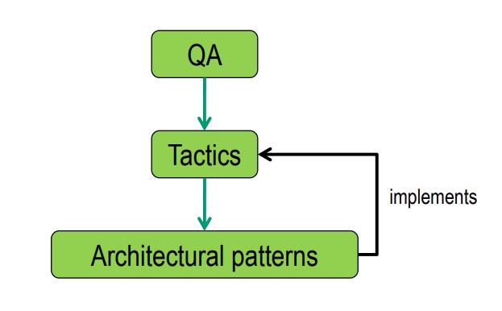
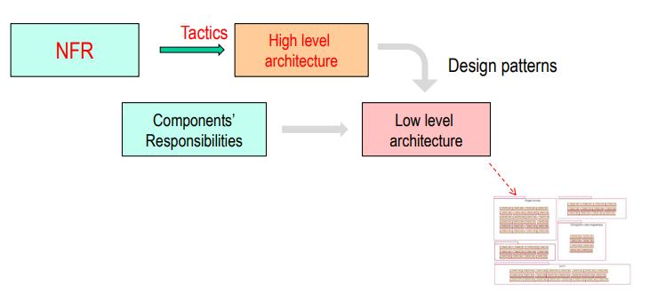

# 626-1 GENIE LOGICIEL

# INFORMATION
CC : tous ce qu'on a vu depuis le début et les 3 premiers tps. Il peut nous demander des concepts. On a le droit à tout.

Examen final : on peut nous demander d'expliquer une architecture, les patterns, pourquoi on utilise CQRS, pourquoi ...

# CONTENTS
1. [Lecture note 1](https://github.com/RiriJane/8th-sem-heg/blob/main/626-1_Architecture_sys_info/G%C3%A9nie%20Logiciel/626-1_genie_logiciel.md#lecture-note-1---architecting-systems)
    - [Designing the high level architecture](https://github.com/RiriJane/8th-sem-heg/blob/main/626-1_Architecture_sys_info/G%C3%A9nie%20Logiciel/626-1_genie_logiciel.md#designing-the-high-level-architecture)
      - [Vue d'ensemble : Architecting steps](https://github.com/RiriJane/8th-sem-heg/blob/main/626-1_Architecture_sys_info/G%C3%A9nie%20Logiciel/626-1_genie_logiciel.md#vue-densemble--architecting-steps)
    - [QA Tactics](https://github.com/RiriJane/8th-sem-heg/blob/main/626-1_Architecture_sys_info/G%C3%A9nie%20Logiciel/626-1_genie_logiciel.md#qa--tactics)
    - [Performance Tactics](https://github.com/RiriJane/8th-sem-heg/blob/main/626-1_Architecture_sys_info/G%C3%A9nie%20Logiciel/626-1_genie_logiciel.md#performance-tactics)
    - [Availability Tactics](https://github.com/RiriJane/8th-sem-heg/blob/main/626-1_Architecture_sys_info/G%C3%A9nie%20Logiciel/626-1_genie_logiciel.md#availability-tactics)
    - [Modifiability Tactics](https://github.com/RiriJane/8th-sem-heg/blob/main/626-1_Architecture_sys_info/G%C3%A9nie%20Logiciel/626-1_genie_logiciel.md#pourquoi-la-modifiabilite-est-elle-un-probleme--dependances)
    - [Software Architecture](https://github.com/RiriJane/8th-sem-heg/blob/main/626-1_Architecture_sys_info/G%C3%A9nie%20Logiciel/626-1_genie_logiciel.md#software-architecture)
    - [Design principles](https://github.com/RiriJane/8th-sem-heg/blob/main/626-1_Architecture_sys_info/G%C3%A9nie%20Logiciel/626-1_genie_logiciel.md#design-principles)
    - [Architectural Pattern](https://github.com/RiriJane/8th-sem-heg/blob/main/626-1_Architecture_sys_info/G%C3%A9nie%20Logiciel/626-1_genie_logiciel.md#architectural-patttern)
    - [Model-View-Controller](https://github.com/RiriJane/8th-sem-heg/blob/main/626-1_Architecture_sys_info/G%C3%A9nie%20Logiciel/626-1_genie_logiciel.md#model-view-controller)
    - [Publish-Subscribe](https://github.com/RiriJane/8th-sem-heg/blob/main/626-1_Architecture_sys_info/G%C3%A9nie%20Logiciel/626-1_genie_logiciel.md#publish-subscribe)
    - [Facade](https://github.com/RiriJane/8th-sem-heg/blob/main/626-1_Architecture_sys_info/G%C3%A9nie%20Logiciel/626-1_genie_logiciel.md#facade)
    - [Facade et proxy](https://github.com/RiriJane/8th-sem-heg/blob/main/626-1_Architecture_sys_info/G%C3%A9nie%20Logiciel/626-1_genie_logiciel.md#nouvelle-architecture--facade-et-proxy)
      - [Layers](https://github.com/RiriJane/8th-sem-heg/blob/main/626-1_Architecture_sys_info/G%C3%A9nie%20Logiciel/626-1_genie_logiciel.md#layers)
    - [Qu'est-ce que nous modélisons ?](https://github.com/RiriJane/8th-sem-heg/blob/main/626-1_Architecture_sys_info/G%C3%A9nie%20Logiciel/626-1_genie_logiciel.md#quest-ce-que-nous-modelisons-)
      - [Software Components](https://github.com/RiriJane/8th-sem-heg/blob/main/626-1_Architecture_sys_info/G%C3%A9nie%20Logiciel/626-1_genie_logiciel.md#software-components)
          - [Components vs Objects vs Modules](https://github.com/RiriJane/8th-sem-heg/blob/main/626-1_Architecture_sys_info/G%C3%A9nie%20Logiciel/626-1_genie_logiciel.md#components-vs-objects-vs-modules)
          - [Component Interfaces](https://github.com/RiriJane/8th-sem-heg/blob/main/626-1_Architecture_sys_info/G%C3%A9nie%20Logiciel/626-1_genie_logiciel.md#component-interfaces)
          - [Compatible Interfaces](https://github.com/RiriJane/8th-sem-heg/blob/main/626-1_Architecture_sys_info/G%C3%A9nie%20Logiciel/626-1_genie_logiciel.md#compatible-interfaces)
          - [Software Connectors](https://github.com/RiriJane/8th-sem-heg/blob/main/626-1_Architecture_sys_info/G%C3%A9nie%20Logiciel/626-1_genie_logiciel.md#software-connectors)
          - [Connector roles](https://github.com/RiriJane/8th-sem-heg/blob/main/626-1_Architecture_sys_info/G%C3%A9nie%20Logiciel/626-1_genie_logiciel.md#connector-roles)
    - [View and viewpoints](https://github.com/RiriJane/8th-sem-heg/blob/main/626-1_Architecture_sys_info/G%C3%A9nie%20Logiciel/626-1_genie_logiciel.md#view-and-viewpoints)
    - [Use Case Scenarios](https://github.com/RiriJane/8th-sem-heg/blob/main/626-1_Architecture_sys_info/G%C3%A9nie%20Logiciel/626-1_genie_logiciel.md#use-case-scenarios)
2. [Lecture note 2](https://github.com/RiriJane/8th-sem-heg/blob/main/626-1_Architecture_sys_info/G%C3%A9nie%20Logiciel/626-1_genie_logiciel.md#lecture-note-2)
    - [Quality Attribute with REST](https://github.com/RiriJane/8th-sem-heg/blob/main/626-1_Architecture_sys_info/G%C3%A9nie%20Logiciel/626-1_genie_logiciel.md#quality-attribute-with-rest)
      - [Statelessness](https://github.com/RiriJane/8th-sem-heg/blob/main/626-1_Architecture_sys_info/G%C3%A9nie%20Logiciel/626-1_genie_logiciel.md#statelessness)
    - [Resource Pattern](https://github.com/RiriJane/8th-sem-heg/blob/main/626-1_Architecture_sys_info/G%C3%A9nie%20Logiciel/626-1_genie_logiciel.md#resource-pattern)
      - [Request acknowledge](https://github.com/RiriJane/8th-sem-heg/blob/main/626-1_Architecture_sys_info/G%C3%A9nie%20Logiciel/626-1_genie_logiciel.md#request-acknowledge)
        -[Poll](https://github.com/RiriJane/8th-sem-heg/blob/main/626-1_Architecture_sys_info/G%C3%A9nie%20Logiciel/626-1_genie_logiciel.md#requestacknowledgepoll)
        - [Callback](https://github.com/RiriJane/8th-sem-heg/blob/main/626-1_Architecture_sys_info/G%C3%A9nie%20Logiciel/626-1_genie_logiciel.md#requestacknowledgecallback)
    - [Collection Pattern](https://github.com/RiriJane/8th-sem-heg/blob/main/626-1_Architecture_sys_info/G%C3%A9nie%20Logiciel/626-1_genie_logiciel.md#collection-pattern)
    - [Reminder Atom](https://github.com/RiriJane/8th-sem-heg/blob/main/626-1_Architecture_sys_info/G%C3%A9nie%20Logiciel/626-1_genie_logiciel.md#reminder-atom---minimal-uml-model)
    - [Pattern : Data Transfer Objects](https://github.com/RiriJane/8th-sem-heg/blob/main/626-1_Architecture_sys_info/G%C3%A9nie%20Logiciel/626-1_genie_logiciel.md#pattern--data-transfer-objects)
    - [Communication "Meta Patterns"](https://github.com/RiriJane/8th-sem-heg/blob/main/626-1_Architecture_sys_info/G%C3%A9nie%20Logiciel/626-1_genie_logiciel.md#communication-meta-patterns)
3. [Lecture note 5](https://github.com/RiriJane/8th-sem-heg/blob/main/626-1_Architecture_sys_info/G%C3%A9nie%20Logiciel/626-1_genie_logiciel.md#lecture-note-5)
    - [Les erreurs (Fallacies) de l'informatique distribuées](https://github.com/RiriJane/8th-sem-heg/blob/main/626-1_Architecture_sys_info/G%C3%A9nie%20Logiciel/626-1_genie_logiciel.md#les-erreurs-fallacies-de-linformatique-distribuees)
    - [Timeout Patterns](https://github.com/RiriJane/8th-sem-heg/blob/main/626-1_Architecture_sys_info/G%C3%A9nie%20Logiciel/626-1_genie_logiciel.md#timeout-patterns)
    - [Client Circuit Breaker](https://github.com/RiriJane/8th-sem-heg/blob/main/626-1_Architecture_sys_info/G%C3%A9nie%20Logiciel/626-1_genie_logiciel.md#client-circuit-breaker)
    - [SOA](https://github.com/RiriJane/8th-sem-heg/blob/main/626-1_Architecture_sys_info/G%C3%A9nie%20Logiciel/626-1_genie_logiciel.md#soa--service-oriented-architecture)
    - [Microservices](https://github.com/RiriJane/8th-sem-heg/blob/main/626-1_Architecture_sys_info/G%C3%A9nie%20Logiciel/626-1_genie_logiciel.md#microservices)
      - [Distributed application](https://github.com/RiriJane/8th-sem-heg/blob/main/626-1_Architecture_sys_info/G%C3%A9nie%20Logiciel/626-1_genie_logiciel.md#distributed-application)
      - [Architecting large systems](https://github.com/RiriJane/8th-sem-heg/blob/main/626-1_Architecture_sys_info/G%C3%A9nie%20Logiciel/626-1_genie_logiciel.md#architecting-large-systems)
      - [Calling architecture : Orchestration and choreography](https://github.com/RiriJane/8th-sem-heg/blob/main/626-1_Architecture_sys_info/G%C3%A9nie%20Logiciel/626-1_genie_logiciel.md#calling-architecture--orchestration-and-choreography)
    - [L'approche traditionnelle de system desing](https://github.com/RiriJane/8th-sem-heg/blob/main/626-1_Architecture_sys_info/G%C3%A9nie%20Logiciel/626-1_genie_logiciel.md#lapproche-traditionnelle-de-system-design)
4. [Lecture note 6](https://github.com/RiriJane/8th-sem-heg/blob/main/626-1_Architecture_sys_info/G%C3%A9nie%20Logiciel/626-1_genie_logiciel.md#lecture-note-6)
    - [Cap Theorem](https://github.com/RiriJane/8th-sem-heg/blob/main/626-1_Architecture_sys_info/G%C3%A9nie%20Logiciel/626-1_genie_logiciel.md#cap-theorem)
    - [Command Query Responsibility Segregration (CQRS Patterns)](https://github.com/RiriJane/8th-sem-heg/blob/main/626-1_Architecture_sys_info/G%C3%A9nie%20Logiciel/626-1_genie_logiciel.md#command-query-responsibility-segregration-cqrs-patterns)
    - [Event Sourcing Pattern](https://github.com/RiriJane/8th-sem-heg/blob/main/626-1_Architecture_sys_info/G%C3%A9nie%20Logiciel/626-1_genie_logiciel.md#event-sourcing-pattern)
5. [Lecture note 7](https://github.com/RiriJane/8th-sem-heg/blob/main/626-1_Architecture_sys_info/G%C3%A9nie%20Logiciel/626-1_genie_logiciel.md#lecture-note-7)
    - [Implementing CQRS](https://github.com/RiriJane/8th-sem-heg/blob/main/626-1_Architecture_sys_info/G%C3%A9nie%20Logiciel/626-1_genie_logiciel.md#implementing-cqrs)
    - [PubSubHub Pattern](https://github.com/RiriJane/8th-sem-heg/blob/main/626-1_Architecture_sys_info/G%C3%A9nie%20Logiciel/626-1_genie_logiciel.md#pubsubhub-pattern)
    - [Java Thread](https://github.com/RiriJane/8th-sem-heg/blob/main/626-1_Architecture_sys_info/G%C3%A9nie%20Logiciel/626-1_genie_logiciel.md#java-thread)
    - [CQRS in action](https://github.com/RiriJane/8th-sem-heg/blob/main/626-1_Architecture_sys_info/G%C3%A9nie%20Logiciel/626-1_genie_logiciel.md#cqrs-in-action)


# LECTURE NOTE 1 - ARCHITECTING SYSTEMS

**Architecting systems** : determine les performances, coûts, risques, tendances economique, mouvement concurrents, "ilities"...
- **ilities** : ce sont des NFR (Non-functional requirement) tel que "availability", "operability", "manufacturability", ""survivability".

## DESIGNING THE HIGH LEVEL ARCHITECTURE


#### DESIGNING THE HIGH LEVEL ARCHITECTURE : BASED ON NFR - 2 CONCEPTS
1. **Architectural tactic** : une décision de conception qui permet d'obtenir une réponse spécifique en terme d'attributs de qualité (Quality attribute), fait par un "quality-attribute analysis model".
2. **Architectural pattern (architectural style)** :  une schema d'organisation structurelle fondamentaux pour les systèmes logiciels qui fournit un ensemble de sous-systèmes prédéfinis en spécifiant leurs responsabilités, les règles et lignes directives pour organiser les relations entre eux.

#### VUE D'ENSEMBLE : ARCHITECTING STEPS


- On utilise des tactics pour améliorer un design patterns.
- Low level architecture : design plus détaillés par exemple Builder, Factory.

Notes Cyril : L'architectural tactic est une stratégie de design, alors que l'architectural pattern c'est un style. Ce sont deux concepts très importants. Les "tactics" engendrent une architecture de haut niveau, et rajouter le design pattern fait passer en bas niveau (beaucoup plus détaillé).

Une tactique pourrait être une amélioration de l'efficacité du programme (en utilisant un meilleur algorithme), la cadence des évènements (pour les besoins de computation), l'utilisation du cache, etc. On devra traiter les tactiques de l'application choisie dans la présentation.

## QA : TACTICS
- Combien de temps le système met-il à réagir à un événement (latence) ?  
- Source de complication : le nombre de sources d'événements et leur séquence d'arrivée.
- Source des problèmes de performance : disponibilité des ressources nécessaires (plus de RAM,CPU)

## PERFORMANCE TACTICS

#### DEMANDE DES RESSOURCES
- Augmenter l'efficacité des calculs (meilleurs algorithmes)
- Réduire la charge de calcul (ne pas gaspiller le temps du processeur)
- Gérer le taux d'événements (limiter les besoins de calcul)

#### GESTION DES RESSOURCES
- Introduire la concurrence (threads)
- Maintien de plusieurs copies de données ou de calcul (cache)

#### ARBITRAGE DES RESSOURCES
- First in, first out
- Ordonnancement à priorité fixe

## AVAILABILITY TACTICS
La disponibilité concerne les défaillances du système et leurs conséquences.
- Une défaillance se produit lorsque **le système ne fournit plus un service** conforme à ses spécifications.
- Un défaut devient une défaillance lorsqu'il est observable par l'utilisateur du système.
  - Alors, une façon d'éviter une défaillance est de détecter et de corriger une défaillance avant qu'elle ne devienne observable par l'utilisateur.


## POURQUOI LA MODIFIABILITE EST-ELLE UN PROBLEME ? DEPENDANCES


Notes Cyril :
La modificabilité est un gros problème. Il faut s'assurer que les composants et leurs dépendances soient au point. Il faut augmenter la cohésion dans un composant et diminuer le couplage. Un changement dans le programme ne doit pas affecter l'intégrité du programme.

#### MODIFIABILITY TACTICS


# DESIGN IN THE LARGE


## SOFTWARE ARCHITECTURE
- Plan de construction et d'évolution
  - abstraction - principales décisions de conception
- Pas seulement une question de conception
  - communiquer - visualiser - représenter - qualité
- Chaque application en a un, qui évolue
  - descriptive - prescriptive - dérive - érosion
- Pas une phase de développement

> A software system's architecture is the set of principal design decisions made about the system

Note Cyril :
Ce qu'on appelle l'architecture, ce sont les décisions de design du système. À la base du système, il y a un architecte et le concept du logiciel. L'architecture n'est pas une phase de développement, il y a besoin d'un architecte pendant toute la vie du projet. Quand on crée une architecture, on commence par les NFR, on utilise les tactiques pour créer une architecture de haut-niveau puis les design pattern pour le bas-niveau.


#### WHEN DOES SOFTWARE ARCHITECTURE START ?


#### WHEN DOES SOFTWARE ARCHITECTURE STOP ?


#### WHAT MAKES A GOOD ARCHITECTURE ?
- Il n'existe pas de conception parfaite ni une bonne/mauvaise architecture
- Adaptée à un certain objectif et dépendante du contexte.
- Principes, lignes directrices et utilisation de l'expérience collective (méthode)

Principes de conception - Arch. Modèles - Arch. Styles

## DESIGN PRINCIPLES
- Abstraction
- Encapsulation - séparation des préoccupations
- Modularisation
- KISS (keep it simple, stupid)
- DRY (Don't repeat yourself)

Notes Cyril :
Les principes de design sont notamment l'abstraction (rassemblement du QUOI (NFR), du COMMENT (design) et du POURQUOI), l'encapsulation et la modularisation.

## ARCHITECTURAL PATTTERN
> An architectural pattern is a set of architectural design decisions that are applicable to a recurrring design problem, and parameterized to account for different software development contexts in which that problem appears.


Problem : traitement complexe avec plusieurs niveaux d'abstraction de inputs/outputs

## MODEL-VIEW-CONTROLLER
- Plus connu dans l'archecture des systèmes intéractifs.


Note Cyril :
Il permet de résoudre plusieurs problèmes de conception et difficulté (vues multiples/synchrones par exemple) mais a comme répercussions la complexité et le couplage  -> voir diagrammes sur les slides. Le modèle est responsable du processing des données, la vue de l’output pour l’utilisateur, et le contrôleur de l’input et des appels associés à ces inputs.

Si on est développeur de backend et qu'on doit créer la documentation des API (par exemple pour ceux du frontend pour savoir comment connecter), on peut utiliser l'API console documentation.

Une API, c'est un connecteur. Si on crée une nouvelle plateforme, on doit créer une API pour connecter les sources externes à la plateforme. En Python, on utilise Django pour créer une API pour les services web.


**Implemented tactics**

Modifiability tactics : anticipe les changements attendus, sépare les préoccupations


**Problem** : Les interfaces utilisateur sont les plus fréquemment touchées par les changements.
- Comment puis-je représenter la même information de différentes manières ?
- Comment puis-je garantir que les modifications apportées à l'ensemble de données seront instantanément dans toutes les vues ?
- Comment puis-je modifier l'interface utilisateur ? (éventuellement au moment de l'exécution)
- Comment prendre en charge plusieurs interfaces utilisateur sans modifier le cœur de l'application ?
de l'application ?

**Solution** : Le modèle Model-view-controller divise l'application en trois parties :
- Le modèle est responsable du traitement,
- La vue s'occupe de la sortie,
- Le contrôleur s'occupe de l'entrée.

#### STRUCTURE


- Chaque model peut enregistrer plusieurs observateurs (vues et contrôleurs).
- Dès que le modèle change, tous les observateurs enregistrés sont notifiés, et ils se mettent à jour en conséquence.

#### PARTICIPANTS - MODEL
Le modèle encapsule les données et les fonctionnalités de base ; il est indépendant de toute représentation concrète de sortie ou de tout comportement d'entrée.


#### PARTICIPANTS - VIEW
La vue affiche les informations à l'utilisateur. Un modèle peut avoir plusieurs
vues.


#### PARTICIPANTS - CONTROLLER
Le contrôleur traite les entrées et invoque les services appropriés de la vue ou du modèle. Chaque contrôleur est assigné à une seule vue ; un modèle peut avoir plusieurs contrôleurs.


#### DYNAMIC BEHAVIOUR


#### CONSEQUENCES OF THE MODEL-VIEW-CONTROLLER PATTERN
Avantages :
- Vues multiples du même système
- Vues synchrones
- Vues et contrôleurs attachables

Inconvénients :
- complexité accrue
- couplage fort entre le modèle et la vue
- couplage fort entre le modèle et les contrôleurs (peut être évité au moyen du patron de commande)

Applications connues : Bibliothèques d'interface graphique, Smalltalk, Microsoft Foundation Classes

## PUBLISH-SUBSCRIBE


#### IMPLEMENTED TACTICS
Tactiques de modifiabilité :
- Restreindre les voies de communication
- Utiliser un intermédiaire
- Normaliser la collaboration

**Problem : point à point communications entre les composants**


**Problem : trop de chemins de communications**


## FACADE


Note Cyril :  Le problème des systèmes, c'est qu'ils sont très complexes. On crée donc une interface (appelée facade), alors laquelle les clients peuvent se connecter. C'est aussi utile pour cacher l'information ou pour améliorer la lisibilité par exemple. Parfois ce pattern est combiné à un proxy.

On monte parfois son architecture en couches. Cela donne une meilleure structure. Si on a beaucoup de choses à montrer, on a besoin d'une couche de présentation. Dans chaque couche, on a des sous-couches. Choisir le nombre de couches est important, c'est un équilibre à trouver mais généralement on n'en veut pas beaucoup. L'interface fonctionne comme une façade pour chaque couche, et chacune d'elles utilise des technologies différentes.

On a des composants, des objets et des modules dans un logiciel. Quand on crée une architecture, on doit d'abord créer le composants (classe, interface, …). Il y a de l'input et de l'output.

Exemple de technologies :

Présentation : Tableaux, SSRS, powerBJ  ??

Business :
  - ETL : SSIS, Pentahom Scala, Php, Shell, Python, Java, Jupyter, ...
  - BI/ML : R, Python, Juliam Azure ML,...
  - Automation : Jenkins, Nifi, data Factory

Data : MySQL, SqlServer, Postgre, MongoDB, Cassandra, HBase, ...

Monsieur Behfar a créé une architecture qui propose les meilleurs prix de plusieurs entreprises de vêtements tels que H&M et Zara. Le problème c'est que les API ne sont pas les mêmes, il doit d'abord créer un connecteur qui se connecte à toutes les API. Il a donc créé une facade, ainsi que des composants de types adapter, ainsi que wrapper (qui donne la possibilité de connecter plusieurs API en même temps.
On doit aussi, pour créer une architecture, des vues. Il y a trois possibilités, mais celle qui importe c'est le modèle Kruchten 4+1 : une vue logique (décompose le système en composants et connecteurs et mappe les fonctionnalités), une vue de développement (on mappe le code et les éléments de la vue logique ?), une vue de process (on explique la communication entre les processus) et la vue physique (réseau, stockage, etc.).


#### IMPLEMENTED TACTICS
Tactiques de modifiabilité
- Cacher l'information
- Restreindre les voies de communication
- Utiliser un intermédiaire

#### NOUVELLE ARCHITECTURE : FACADE ET PROXY


#### LAYERS


Choisir les couches:
- Définir le critère d'abstraction (préoccupation) que chaque couche fournit (cibles)
  - Changements potentiels
  - Opportunités de réutilisation
  - Catégorie de responsabilités
- Choisir le nombre de couches
  - Niveaux d'abstraction / nombre de catégories
  - Maintenir un nombre réduit de couches
   - Éviter les surcharges de performance
- Spécifier l'interface de chaque couche
  - Chaque couche doit représenter une boîte noire pour la couche supérieure.


#### CHANGEMENT DANS L'UNE DES PREOCCUPATIONS : AFFICHAGE, ACCES AUX DONNES


#### EXEMPLE


#### REPRESENTATION JAVA


## QU'EST-CE QUE NOUS MODELISONS ?
- Le système à venir (modèle de conception)
 - Architecture statique
 - Architecture dynamique
- Attributs de qualité et propriétés non fonctionnelles
- Le problème (modèle de domaine)
- L'environnement (contexte du système et parties prenantes)
- Le processus de conception

#### SOFTWARE COMPONENTS


#### COMPONENTS VS OBJECTS VS MODULES
Components :
- Encapsuler l'état et la fonctionnalité
- Grain grossier
- Éléments d'architecture de la boîte noire
- Structure de l'architecture

Objects :
- Encapsuler l'état et la fonctionnalité
- Grain fin
- Peuvent se "déplacer" entre les composants
- Unité d'instanciation identifiable
Modules
- Existent rarement au moment de l'exécution
- Peuvent nécessiter d'autres modules pour être compilés
- Emballer le code

#### COMPONENT INTERFACES


Provided interfaces : Spécifier et documenter les fonctionnalités visibles de l'extérieur (ou l'API publique) offertes par le composant.
- Types de données et modèle
- Opérations
- Propriétés
- Événements et rappels

Required interfaces : spécifier les conditions dans lesquelles un composant peut être réutilisé
- La plate-forme est compatible
- L'environnement est correctement configuré

#### COMPATIBLE INTERFACES
Les interfaces des composants doivent correspondre parfaitement pour être  connectées.


#### SOFTWARE CONNECTORS


Modéliser les aspects statiques et dynamiques d'interaction entre les interfaces des composants.
- Les connecteurs ne sont généralement pas directement visibles dans le code, ce qui n'est pas le cas des composants.
- Les connecteurs sont le plus souvent indépendants de l'application, alors que les composants peuvent être à la fois dépendants ou non de l'application

#### CONNECTOR ROLES
- Communication : fourniture de données et transfert de contrôle, prise en charge de différents mécanismes de communication, qualité de la fourniture de données et du transfert de contrôle, mécanismes de communication, qualité de la livraison.
- Coordination : contrôle de la transmission des données, séparation du contrôle et du calcul.
- Conversion : permettre l'interaction de composants mal adaptés.
- Facilitation : médiation de l'interaction entre les composants, gestion de l'accès aux informations partagées, assure la synchronisation.

## VIEW AND VIEWPOINTS
How many views ?
- 5 par Taylor et al : Logique, Physique, Déploiement, Concurrence, Comportemental
- 3 par Bass et al : Composant et connecteur, module Vue, Comportement
- 4+1 par Kruchten : Logique, physique, processus, Développement, et Scénario

#### HISTORICAL MODEL: KRUCHTEN’S 4+1 VIEWS (RUP)


#### LOGICAL VIEW


#### Development view


#### PROCESS VIEW


#### PHYSICAL VIEW


## USE CASE SCENARIOS
- Unifier et relier les éléments des 4 autres vues.
- Les scénarios permettent de s'assurer que le modèle architectural est complet par rapport aux exigences.
- L'architecture peut être décomposée en fonction des scénarios et illustrée à l'aide des 4 autres vues.

#### MUSIC PLAYER SCENARIOS
- Rechercher de nouvelles chansons.
- Payer pour écouter la chanson en entier.
- Télécharger la chanson achetée sur le téléphone.
- Écouter la chanson.

#### LOGICAL VIEW


- Décomposer la structure du système en logiciels composants et connecteurs.
- Faire correspondre les fonctionnalités (cas d'utilisation) aux composants.
- **Concerne** : Fonctionnalité
- **Public cible** : Développeurs et utilisateurs

#### PROCESS VIEW


- Modéliser les aspects dynamiques de l'architecture et le comportement de ses parties
  - composants actifs
  - les threads concurrents
- Décrire comment les processus/threads communiquent
  - RPC
  - Bus de messages
- **Concerne** : Fonctionnalité, performance
- **Public cible** : Développeurs

#### DEVELOPMENT VIEW

- Organisation statique des artefacts du code logiciel
  - Paquets
  - Modules
  - Binaires
- Correspondance entre les éléments de la vue logique et les artefacts de code.
- **Concerne** : Réutilisation, portabilité, construction
- **Public cible** : Développeurs

#### PHYSICAL VIEW

- Environnement matériel dans lequel le logiciel sera déployé.
  - Hôtes
  - Réseaux
  - Stockage
- Correspondance entre les entités logiques et physiques.
- **Concerne** : Attributs de qualité
- **Public cible** : Opérations

## REUSE AND LIBRARIES
Est-il possible de réutiliser des classes existantes ? Il est possible que des classes d'adaptation soient nécessaires.

# LECTURE NOTE 2
#### QUALITY ATTRIBUTE WITH REST
Fonctionnalité pour la performance : statelessness, interface uniforme, adressabilité

Statelessness permet la tactique suivante : "Introduire la concurrence".
  - Puisque les demandes peuvent être traitées de manière isolée, indépendamment des demandes précédentes, elles peuvent être distribuées sur plusieurs machines sans impact sur le résultat du traitement.
  - Permet de comprendre chaque demande de manière isolée. En effet, tout le contexte pour interpréter une demande est dans la demande.

Interface uniforme et adressabilité : Permet la visibilité et la simplicité du protocole. Chaque demande est transparente (facilement interprétable)

#### STATELESSNESS
**Statelessness** : pas de sessions utilisateur dans le server. Le serveur ne doit pas enregistrer les états d'un utilisateur. Il n'enregistre que les états ressources. Par exemple, l'achat en ligne. Le serveur doit savoir ce que le client va acheter, c'est donc un état de ressource. Mais, si le client navigue seulement, ce sont des états de clients.
Etat : configuration interne d'un système qui spécifie la réponse à l'événement qu'il reçoit.

Notes Cyril :
Le concept de statelessness signifie que les requêtes doivent être indépendantes les unes des autres du point de vue du serveur. C'est important car cela permet de partager les requêtes entre différents serveurs et, ainsi, la tactique de "concurrence" des serveurs. Il est interdit d’utiliser des variables statiques ou globales dans une architecture « stateless ».

2 types d'états :
- **L'état de la ressource** : configuration d'une ressource sur le serveur qui est disponible pour tous les clients. Cela détermine quelle représentation on peut obtenir de la ressource. Côté serveur. Accessible à tous les clients.
- **L'état du client** : la configuration du client qui détermine la prochaine requête qu'il pourrait émettre ensuite (suite à une entrée utilisateur par exemple). On l'appelle aussi **l'état de l'application**. Côté client. Spécifique au client.

Toutes requêtes doivent être indépendant de chacune entres elles de point de vue du serveur.
- Le serveur n'enregistre pas les intéractions avec un client particulier.
- Chaque client "navigue" parmi les ressources et enregistre le dernier état (du client) qu'il a abouti.


## RESOURCE PATTERN
Patterns basique pour intéragir avec les ressources.

Notes Cyril :

Sur le serveur, on peut avoir des fichiers (par exemple XML), qui sont des ressources. Généralement, on partage la représentation d'une ressource (par exemple une URL). On utilise les hypermédias (lien) pour connecter la représentation des ressources qui définit l'adresse des ressources sur le serveur.

Lorsqu'en tant que client, on navigue sur Amazon, les données nous concernant sont stockées localement dans les cookies (état client). Lorsqu'on ajoute un article dans le panier, en revanche, c'est stocké sur le serveur (état ressource) dans un header avec un token permettant d'identifier un utilisateur.

Ajouter une query dans la représentation de ressource (url) est une possibilité, mais le serveur peut également retourner une deuxième url dans le header.


#### REQUEST ACKNOWLEDGE
**Problem** : Comment gérer des services durables, c'est-à-dire, services qui ne peuvent pas répondre immédiatement.
**Solutions** : Request/acknowledge/poll, Request/acknowledge/callback
External sources : http://servicedesignpatterns.com/clientserviceinteractions/requestacknowledge

Notes Cyril :
L'un des problèmes importants est la gestion de longs services où les serveurs ne répondent pas immédiatement : request/acknowledge/poll & request/acknowledge/callback :

#### REQUEST/ACKNOWLEDGE/POLL


Notes Cyril :

Poll : une réponse 303 ((see other) url : parce qu'il ne peut pas immédiatement prendre le résultat : ce n'est pas prêt) est retournée immédiatement et le client doit envoyer une autre requête. Puis une réponse 202 (accepté mais pas prêt), puis 200 (lorsque c'est prêt). Pour faire ça, on calcule l'URL de base, on la trim et on rajoute la deuxième url pour retourner au client. Le service est préparé dans la deuxième url. La fonction getBaseUri() est celle qui permet de trim.

**Interactions**


#### REQUEST/ACKNOWLEDGE/CALLBACK


Note Cyril :
Callback : la requête GET contient l'URL où la réponse doit être envoyée, et le serveur envoie directement une réponse 201 (créée) lorsqu'elle est prête avec une requête POST.

Avec le poll, c'est le client qui envoyait beaucoup de requêtes, mais avec le callback, le client n'en a pas besoin.

**Interactions**


## COLLECTION PATTERN
**Problem** : comment sélectionner des objets dans une collection afin de les transmettre à une autre service ? A cause de la bande passante, on ne peut pas transmettre tous les objets au client afin qu'il puisse en sélectionner un.

**Solution** : créer une représentation d'une collection d'un ensemble des objets. Contenu :
- Description significative pour la sélection
- Identifiant unique


#### FEED
Une collection d'entry ou des objects. Balise HTML :
```
<feed></feed>
```
- éléments réquis : id (URI unique), title, updated (dernière fois que le feed a été modifié)
- éléments recommandés : author, link (identifie une page Web associée)
- un Feed doit contenir un lien de retour à lui-même, c'est une adresse de la réprésentation de la source (rel="SELF")


#### ENTRY
Entry est une collection dans la collection feed. Balise HTML :
```
<entry></entry>
```
- éléments réquis : id (URI unique), title, updated (dernière fois que le entry a été modifié)
- éléments recommandés : author, content (Contenu entier ou un lien alternatif pour compléter le contenu de l'entry. Le contenu en entier doit être fourni s'il n'y a pas de lien alternatif), link

## REMINDER ATOM - MINIMAL UML MODEL


Note Cyril :

Dans l'architecture ATOM (formatage de XML), la couche de business et de domaine, c'est la même chose : pour les objets métier. On a une couche de transport (sur le client et le serveur) puis les API et/ou les entrypoints dans la couche de services. La couche de business permet de tout encapsuler, mais on sépare ce qui existe dans cette couche en les annotant dans la couche de transport qui sert à diviser ces couches : on peut avoir un set dans la couche business mais un subset/un feed qui contient une collection d'objets/quelques entries dans la couche transport.

Créer une collection de représentations permet de réduire le trafic. La collection, c'est un feed, avec un link "self", et l'entry est un id dans la collection avec un link "alternative". Les représentations sont des des liens, des adresses qui représentent les ressources.

Jaxb est utilisé pour le marshalling/unmarshalling (sérialiser/désérialiser) qui est utilisé pour les transports entre le client et le serveur : changement en XML, en JSON, etc… @XmlRootElement permet de changer les objets Java en XML et vice-versa. @XmlAccessType permet de définir quels éléments doivent être transportés, comme les FIELD par exemple avec .FIELD.

DTO (data transport object) ne contient que les éléments que l'on souhaite transporter : l'auteur et le titre d'un livre mais pas tout le livre. Cela sert aussi à mimiser le trafic sur le réseau. Ce n’est pas un objet métier et ne peut donc pas être annoté.

Dans l'entrypoint, on a un POST et un GET. On définit le path en tête de classe, en tête de méthode, et dans le fichier web.xml de Tomcat (pour le servlet). Dans cette balise <servlet-mapping>, on trouvera une autre <url-pattern> qui contiendra un élément de path qui viendra après l'application pour différencier des autres chemins.


## PATTERN : DATA TRANSFER OBJECTS
**Problem** : pour minimiser le trafic réseau, on ne veut pas envoyer/recevoir toutes les informations de l'objet de domaine, mais seulement la partie significative pour le service.
- Comment extraire et sélectionner une partie de l'objet de domaine pour le transfert réseau ? Contrainte : on ne veut pas implémenter du code transfer spécifique dans les objets du domaine.
- Lors de la traduction en XML à l'aide d'une bibliothèque standard
(JAXB), comment inclure/exclure des informations ? Contrainte : on ne veut pas ajouter d'annotations dans les objets du domaine

**Solution** : créer un objet de transfert de données pour contenir
seulement la partie de l'objet de domaine que nous devons transférer
(ou parties de plusieurs objets).


#### EXEMPLE : POST
Lors de la publication de représentations pour créer des objets sur le serveur, la représentation peut être envoyée à l'aide d'un DTO.


#### CREATING BOOKS, CLIENT SIDE


#### CREATING BOOKS, SERVER SIDE


#### BOOKS
```
public class Book {
  private String titre;
  private String auteur;
  private int annee;
  private String cote;

  public Book(){}

  public Book(String titre, String auteur, int annee, String cote){
    super();
    this.titre = titre;
    this.auteur = auteur;
    this.annee = annee;
    this.cote = cote;  // <------
  }

  // Setters and getteurs
  // To String
}
```

#### Book Description
```
import javax.xml.bind.annotation.*;

@XmlRootElement
@XmlAccessorType(XmlAccessType.FIELD) // <-------
public class BDTO {
  private String titre;
  private String auteur;
  private int annee;


  public BDTO(){}

  public BDTO(String titre, String auteur, int annee){
    super();
    this.titre = titre;
    this.auteur = auteur;
    this.annee = annee;
  }

  // Getteurs
}
```

#### CLIENT
```
public class BookPOstClient{

  public static main(String[args]) throws Exception {

    BDTO dto  = new BDTO("Seigneur des anneaux", "Tolkien", 1954);
    String url = "http://localhost:8080/DemoPostServer/Books";

    String newURL = new RestInterface().postRemoteObject(url, mediaType.APPLICATION_XML, BDTO.class, dto);

    System.out.println(newUrl);
  }
}

public class BookGetClient{

  public static void main(String[]args){

      String url = "http://localhost:DemoPostServer/books/Tol1945";
      Entry<Book> o = (Entry<Book>)new RestInterface().getRemoteObject(url, MediaType.APPLICATION_ATOM_XML, Entry.class);

      System.out.println(b);

  }

}
```

Note Cyril :

Les classes BookGetClient et BookPostClient de l'exemple servent à envoyer la requête.

#### REST INTERFACE : POST
```
public class RestInferface{

  // Creating a new resource. Retursns the URL of the newly created resource
  public String postRemoteObject(String url, String type, Class objectClass, Object o){
    try{
      // XML Conversion
      OutputStream os = new ByteArrayOutputStream();
      JAXBContext jaxbContext = JAXBContext.newInstance(objectClass);
      Marshaller jaxbMarshaller = jaxbContext.createMarshaller();
      jaxbMarshaller.marshal(o,os);

      // REST service query
      HttpPost request = new HttpPost(url);
      request.setHeader(HttpHeaders.CONTEXT_TYPE, type);
      request.setEntity(new StringEntity(os.toString(), "UTF-8"));
      HttpResponse resp = HttpClientBuilder.create().build().execute(request);
      System.out.println(resp.getStatusLine().getStatusCode()); // <------
      if(resp.getStatusLine().getStatusCode() == 200){
        return resp.getFirstHeader("Location").getValue();
      }
    }catch(Exception e){ e.printStackTrace(); }

    return "";
  }
}
```

#### REST INTERFACE : GET
```
public class RestInferface{

  // Getting a remote resource. Retursns an Object that must be Type cast
  public Object getRemoteObject(String url, String type, Class objectClass){
    Object result = null;
    try{
      // REST service query
      HttpClient client = HttpClientBuilder.create().build();
      HttpGet request = new HttpGet(url);
      request.setHeader(HttpHeaders.ACCEPT, type);
      HttpResponse resp = client.execute(request);

      // XML Conversion
      JAXBContext jaxbContext = JAXBContext.newInstance(objectClass);
      Unmarshaller Unmarshaller = jaxbContext.createUnmarshaller();
      System.out.println(resp.getStatusLine().getStatusCode()); // <------
      if(resp.getStatusLine().getStatusCode() == 200){
        result = Unmarshaller.unmarshal(resp.getEntity().getContent());
      }
    }catch(Exception e){ e.printStackTrace(); }

    return result; // Type casting must be done in the caller method
  }
}
```

#### SERVICES
```
@Path("/")
public class EntryPoint(){

  @POST
  @Path("books")
  @Consumes(MediaType.APPLICATION_XML)
  public void createBook(BDTO input, @Context HttpServletResponse response, @Context UriInfo uriInfo) throws Exception{

    String baseURL = uriInfo.getBaseUri().toString();
    String auteur = input.getAuteur();
    String cote = auteur.subString(0,3)+input.getAnnee(); // <-------------

    // ici devrait se trouver l'insertion du livre dans la BD
    // Ensuite on retourne l0URL du livre inséré
    response.setStatus(HttpServletResponse.SC_CREATED); // <-------------
    response.setHeader(HttpHeaders.LOCATION, baseURL+"books/"+cote); // <-------------
    try{
      response.flushBuffer();
    }catch(Exception e){}
  }

  @GET
  @Path("books/{cote}")
  @Produces(MediaType.APPLICATION_ATOM_XML)
  public Entry<Book> getBook(@PathParam("cote") String cote, @Context UriInfo uriInfo) throws Exception{

    String baseURL = uriInfo.getBaseUri().toString();


    // ici devrait se placer la recherche du livre dans la BD à partir de la "cote"
    // Simulation du livre trouvé, si non trouvé on devrait retourner 404
    Book b = new Book("Seigneur des anneux", "Tolkien", 1954, "Tol1954");
    return new Entry<Book>("book "+cote, baseURL+"books/"+cote, b, true); // <-------------
  }
}
```

#### TEST : RESOURCE CREATION
```
public class BookPostClient{

  public static void main(String[]args) throws Exception{
    BDTO dto = new BDTO("Seigneur des anneaux", "Tolkien", 1954);
    String url = "http://localhost:8080/DemoPostServer/books/";

    String new Url = new RestInferface().postRemoteObject(url, MediaType.APPLICATION_XML, BDTO.class, dto);
    System.out.println(newUrl); // <------
  }
}
```


#### Test: getting the resource
```
public class BookGetClient{

  public static void main(String[]args){

    String url = "http://localhost:8080/DemoPostServer/books/Tol1945";
    Entry<Book> o = (Entry<Book>)new RestInferface().getRemoteObject(url, MediaType.APPLICATION_ATOM_XML, Entry.class);
    Book b = o.getContents();
    System.out.println(b); // <------
  }
}
```


## DEMO
Tried DemoPostServer in class. View exercice in folder *Demos".

## COMMUNICATION "META PATTERNS"
1. Payload format
    - Lors de la communication entre le client et le server :
      - Les objets métier doivent être transportés avec des objets de transport annotés (Objets Atom).
        - On veut séparer la couche de transport et la couche de business car on a pas nécessairement besoin de passer des informations de la couche de business.
      - Les objets métiers ne seront pas annotés. C'est dans la couche de transport que l'on fera des annotations.
2. Couches de communication applicatives
    - Lors de la conception des couches applicatives client et serveur, dupliquer les couches communes : objet métier et transport à la fois dans le client et le code source du serveur pour vous assurer qu'ils seront identiques.


# LECTURE NOTE 5

## LES ERREURS (FALLACIES) DE L'INFORMATIQUE DISTRIBUEES
- Le réseau est fiable,
- Zéro latence,
- Bande passante à l'infinie,
- Le réseau est sécurisé,
- La topologie ne change pas,
- Le coût du transport est zéro (temps et argent).

[Wikipedia, based on a Peter Deutsch’s paper in 1997]

Conséquence - se préparer aux échecs :
- Timeout
- Circuit breaker
- Use references
- Tolerant reader

## TIMEOUT PATTERNS


**Problem** : éviter d'attendre longtemps si le service ne répond pas à la demande car la connexion n'est pas disponible ou le serveur est occupé.

**Solution** : définissez le temps maximum que votre client attendra avant d'abandonner. Si le délai d'attente a expiré, effectuez une procédure de tolérance aux pannes.

Notes Cyril :

Timeout : s'il y a un problème avec le réseau, on envoie une requête à partir du client mais ne recevons aucune réponse

On peut nous demander les trois timeouts à l'examen : connection timeout (lorsque le client demande une connexion), connect timeout (jusqu’à ce que la connexion en question soit établie) et socket timeout (attente de données post-connexion). Pour les deux derniers, il y a des exceptions qui sont levées. Le concept est très simple: si la réponse (response time) est moins que le timeout, on continue, sinon, on fait une autre procédure (principe de fault tolerance). RequestConfig est un objet utilisé pour setter les timeouts.

#### REQUESTCONFIG
Le HttpClient est configuré pour ne pas attendre plus que la période de temporisation.

**Implementation** : objet RequestConfig à transmettre à la fabrique ClientBuilder pour
configurer les paramètres de connexion au HttpClient.


```
// t1, t2, t3 : temps en millisecondes
RequestConfig requestConfig = RequestConfig.custom()
                                  .setConnectionRequestTimeout(t1)
                                  .setConnectTimeout(t2)
                                  .setSocketTimeout(t3)
                                  .build();
HttpClient client = HttpClientBuilder.create().setDefaultRequestConfig(requestConfig).build();
```
**Que se passe-t-il si un certain délai expire ?**
- Des exceptions sont levées : SocketTimeoutException, ConnectTimeoutException
- Intercepter l'exception pour exécuter la tolérance aux pannes
procédure

```
public static void main(String[]args) throws Exception {

  RequestConfig requestConfig = RequestConfig.custom()
              .setConnectionRequestTimeout(1)
              .setConnectTimeout(1)
              .setSocketTimeout(100).build();
  HttpClient client = HttpClientBuilder.create()
              .setDefaultRequestConfig(requestConfig).build(); // <--------------

  HttpRequest req1 = new HttpGet("http://localhost:8080/HelloWorld/helloworld");

  try{
    HttpResponse resp = client.execute(req1);
    print(resp);
  }catch (Exception e){
    System.out.println("Timeout"); // Fault tolérance procedure
  }

}

public static void print(HttpResponse resp) throws Exception{

  System.out.println(resp.getStatusLine().getStatusCode());

  if(resp.getStatusLine().getStatusCode() < 300){
      BUfferedReader rd = new BUfferedReader(new InputStreamReader(response.getEntity().getContent()));
      StringBuffer result = new StringBuffer();
      String line = "";
      while ((line = rd.readLine()) != null ){
          result.append(line);
      }
      System.out.println(result);

  }

}
```

#### EXEMPLE D'UNE SERVICE LENTE

**Service**


**Client**


**Test1 : Limit 1'000'000**


**Test2 : Limit 10'000'000**


#### DEMO
On a testé le DemoTimeoutClient et DemoTimeOutServer

## CLIENT CIRCUIT BREAKER


**Problème** : évitez d'appeler un service, lorsque nous savons qu'il n'est pas disponible.

**Solution** : utilisez un circuit breaker object qui filtre les requêtes vers des
service indisponible.

- Lorsqu'une panne est détectée plusieurs fois (doit être loggé dans un certains services de health log), le breaker s'ouvre.
- La prochaine fois que l'appel revient immédiatement (il doit également être loggé), sans appeler le servicer et le client doivent effectuer des travaux alternatifs.
- Après un certain temps, le circuit breaker laissera passer l'appel au service pour vérifier la disponibilité. Si OK, le circuit breaker se ferme et transmettra les prochaines requêtes au serveur.

**State graph**


Note Cyril :

Circuit breaker est utilisé dans les mêmes cas de figure : on envoie une requête mais la ressource est indisponible ou il y a une erreur sur le réseau.  Le principe du timeout, c'est qu'on utilise une URL2 (fault tolerance) à la place de l’URL1, mais avec le pattern Circuit Breaker, c'est différent : on arrête complètement d'envoyer la requête sur le serveur. C'est le même concept que dans les circuits électroniques : si la ressource est indisponible : on ouvre le circuit. Sinon, on le ferme.

En termes de code, c'est le même principe que pour le timeout, mais au lieu d'un try/catch, on fait une boucle où on essaie 3 fois d'atteindre la ressource et on ouvre/arrête le breaker si ça ne marche pas.

Cela clôt les resource patterns. Ils interagissent avec la ressource. En fonction du pattern implémenté, la réponse/le comportement est différent.


#### REMINDER : MAIN HTTP CLIENT CLASSES


#### EXAMPLE : UNE VERSION SIMPLE D'UN CIRCUIT BREAKER, DEUX ETATS : OUVERT ET FERME


## DEMO
On a testé le DemoCircuitBreakerClient et DemoTimeOutServer

## SOA : SERVICE ORIENTED ARCHITECTURE
Un modèle d'interaction applicative qui met en œuvre des services (composants logiciels).


- Les composants de service peuvent varier en taille, des petits services d'application aux très grands services d'entreprise.
- Il est courant d'avoir un composant de service au sein de la SOA représenté par un gros produit ou même un sous-système.

Note Cyril :
On passe donc au chapitre "service composition" : SoA (service-oriented architecture). Supposons que dans une entreprise on ait des applications qui contiennent tous des business services (service scheduling, order processing, etc.) qui interagissent tous avec des BDD différentes. C'est une architecture dite monolithique qui n'est que très peu scalable. La différence que SoA apporte est une couche supplémentaire pour y encapsuler les business services. Les applications peuvent ainsi être développées indépendamment les unes des autres et sont donc évolutives. La SoA est donc basée sur les microservices, mais le niveau de granularité est moins fin que dans une architecture pure de microservices. Elle ajoute un nouveau critère de qualité (QA) extrêmement important : l'adaptabilité. Cela signifie que si on a un changement dans l'architecture, elle doit être adaptable/scalable : si l'architecture est monolithique et un développeur part, le projet est très fortement compromis, c'est pourquoi il faut une architecture suivant SoA, notamment quand plusieurs personnes travaillent dessus.


Attention : ces différences (mono/SA/microservices) ont de forte chance de constituer une question d'examen.
Supposons le processus d'immatriculation d'étudiants. On crée une app qui contient quelques services de métier. On a besoin d'un orchestrateur pour appeler tous les services. On pourrait faire ça avec une classe manager (orchestration), mais on peut aussi le faire avec un bus de service (comme pour publish/subscribe : choreography) où les services sont strictement indépendants (losely coupled) et doivent "s'inscrire" aux events adéquats en communiquant avec le bus.


#### QUALITY ATTRIBUTES
**Adaptabilité** : cette architecture est destinée à être adaptable aux évolutions du processus métier d'une entreprise.

**But** : Les performances, l'évolutivité et la déployabilité ne sont pas les principaux QA.

## MICROSERVICES
Source : https://martinfowler.com/articles/microservices.html#CharacteristicsOfAMicroserviceArchitecture

- Une spécialisation d'une approche d'implementation pour les SOA utilisées pour construire des systèmes logiciels déployables indépendamment.
- Le style architectural de microservice est une approche de développement d'une application unique sous la forme d'une suite de petits services, chacun s'exécutant dans son propre processus et communiquant avec des mécanismes légers, souvent une API de ressource HTTP.
- Chaque microservice est indépendamment appelé à travers le réseau.

#### CONSTRAINT : LARGE systems


- Les services sont utilisés en isolément ou en groupe pour effectuer une tâche plus importante (composition).
- Mais les transactions du mainframe ne sont pas adaptées pour construire de grandes fonctions métier (non composables).

#### QUALITY ATTRIBUTES
Same QA as mainframe’s transactions
- Performance
- Isolation (beware of ACID constraints)
- Changeability (but constraints on the data model)

New QA’s for a new world
- Scalability
- Independance
- Deployability
- Changeability

**Scalability** : Si l'une des fonctionnalités du programme est fortement utilisée, il faut pouvoir augmenter les ressources.

**Independance** : Les services ne doivent pas interagir les uns avec les autres. Un changement dans un service ne doit pas avoir d'impact sur les autres services.

**Déploiement** : Les services doivent pouvoir être déployés indépendamment sur différentes VM.

**Changeabilité** : Les services doivent être facilement modifiables sans impact sur le reste du système

#### DISTRIBUTED APPLICATION


#### ARCHITECTING LARGE SYSTEMS
Nous devons construire de grands services (fonctions métier) à partir de services plus simples.


#### CALLING ARCHITECTURE : ORCHESTRATION AND CHOREOGRAPHY
**Orchestration** :
- Un manager orchestre le travail des autres services pour mettre en œuvre la fonction/processus métier.
- Chaque service est explicitement appelé par le gestionnaire.

**Chorégraphie** :
- Architecture de type publish/subscribe : la planification est implicite dans la séquence d'événements générés par chaque service.
- Chaque service s'inscrit à l'événement qu'il doit traiter.


#### EXEMPLE - INSCRIPTION DES ETUDIANTS


**Orchestration**


**Choreography**


## L'APPROCHE TRADITIONNELLE DE SYSTEM DESIGN
- Conception du modèle de données.
- Créer les services qui gèrent chaque partie du modèle.
- Mais cela ne sera pas conforme aux QA d'indépendance et de déployabilité.
  - Les services seront liés via le modèle de données.
  - Le service ne peut pas être déployé indépendamment.

#### EXEMPLE D'INCONVENIENTS


**Consequences**

- ~~Independence~~
  - Si la partie du modèle de données requise par le service 1 est modifiée (classe jaune foncé), il y aura un impact sur les autres services.
- ~~Deployability~~
  - Les services sont fortement liés à la couche de données. Comment pourraient-ils être déployés indépendamment sur plusieurs VM ?

**Solutions**

- Éviter le partage de données entre les services pour les grands
systèmes basés sur des microservices.
- Cela conduit à une nouvelle façon de concevoir les systèmes :
  - Commencez à concevoir des systèmes basés sur des capacités, des fonctionnalités, des services, et non sur des données.

#### CONSTATIONS SUR LA GESTION DISTRIBUEES DES DONNEES
- De nombreux clients interrogent les données tandis que quelques-uns les mettent à jour.
  - La mise à l'échelle (scaling) se produit principalement sur le service de lecture (read service).
  - Mais plusieurs mises à jour peuvent se produire simultanément.
- Les données que les gens regardent ne sont pas garanties d'être à jour.
  - Lorsque quelqu'un récupère des données, quelqu'un d'autre peut les avoir mises à jour simultanément. Ainsi, les données lues peuvent être partiellement obsolètes. C'est
  un fait dans les grands systèmes distribués.
  - Ne surconcevez pas une solution pour éviter que des données obsolètes ne soient affichées. L'impact sur le QA sera trop lourd.

#### CONCLUSION
1. Tous les services n'ont pas besoin du même accès aux données (lecture / écriture).
2. Les services de lecture peuvent avoir besoin d'afficher plusieurs parties du modèle de données alors que les services d'écriture se concentrent généralement sur une seule.
3. La contrainte « Cohérence permanente des données » * doit être libérée pour les grands systèmes distribués.

*(Permanent Data Consistency) Toutes les données sont cohérentes pour tous les clients à tout moment.

# LECTURE NOTE 6

## CAP THEOREM
Source : https://dzone.com/articles/better-explaining-cap-theorem

Il est impossible sur un système informatique de calcul distribué de garantir en même
temps:
- La Consistance des données (Consistency)
- La Disponibilité (Availability)
- La tolérance aux Partitionnement (Partition Tolerance) : le système doit fonctionner
même s’il est partitionné sur plusieurs nœuds.


**Les variables statiques ou globales sont INTERDITES en programmation distribuée (viol du stalessness)**

#### EVITER LA DEPENDANCE DES DONNEES ENTRE LES SERVICES


**Mais comment les synchroniser ?**

## COMMAND QUERY RESPONSIBILITY SEGREGRATION (CQRS) PATTERNS
Source: http://fr.slideshare.net/myfear/cqrs-and-event-sourcing-for-java-developers

**Problème** : comment éviter le couplage de données entre les services qui mettent à jour le modèle de données et les services qui lisent les données ?

**Solution** : créer des services distincts, chacun ayant sa propre représentation des données.
- Le service de mise à jour possède le modèle de référence et fonctionnera comme modèle maître (MASTER).
- Le service de requête maintiendra un modèle de données esclave (SLAVE). Il sera informé de tout changement de modèle de référence.


- Les permissions sont différents que pour les slaves et masters.
- Les mis à jours dans la bdd de write va effectuer les changements dans la bdd de read.


#### RETHINKING THE DATA MODEL
Historiquement, le modèle de données accueillait à la fois les requêtes de lecture et d'écriture.
- Mais la structure requise pour répondre aux requêtes de lecture peut très bien être différente de celle des requêtes d'écriture.
  - Les requêtes d'écriture nécessitent des sous-modèles complets pour garantir les propriétés ACID.
  - Les requêtes de lecture peuvent accéder à plusieurs sous-modèles partiels.
  - Les requêtes de lecture peuvent nécessiter des informations historiques sur les modifications du modèle. Cela peut ne pas être le cas pour les requêtes en écriture.

#### THE READ (SLAVE) MODEL
- Le service de requête n'a pas besoin du modèle complet.
  - Il ne conserve que les données nécessaires pour répondre à la requête
  - Le modèle est proche d'une vue au sens RDB.
- Le service de requête n'a pas besoin d'un SGBDR.
  - Une technique plus simple ferait l'affaire puisqu'aucune contrainte d'intégrité ne doit être appliquée.
- Le modèle de requête sera cohérent à terme.
  - Quand il aura traité tous les événements de mise à jour.

#### IMPLEMENTATION DE CQRS
- On peut utiliser le "Event Sourcing" pattern.
  - Exemple acheter un billet au ciné en même temps, on enregistre la sequence des événements.

## EVENT SOURCING PATTERN
**Problème** : comment enregistrer efficacement l'état et les changements d'état d'un modèle de données ?

**Solution** : conserver la séquence des changements d'état des entités comme source principale de données.
  - L'état actuel des entités peut être reconstruit en naviguant dans la chaîne  d'événements dans l'ordre inverse.
  - Nous pouvons récupérer les valeurs que certains attributs avaient au fil du temps.
  - La chaîne d'événements est immuable.
  Remarque : ce modèle ne doit pas être la seule représentation des données dans un système complexe. Utilisez-le avec précaution.

#### EXEMPLE : RECORDING BOOK SALES


#### AVANTAGES DU MODELE EVENT SOURCING POUR IMPLEMENTER LE READ DATA MODEL
Si le modèle de données est représenté comme une chaîne d'événements immuables, alors :
- Aucune mise à jour des tables, juste un stockage d'événements idempotent. (si une requête identique peut être faite une ou plusieurs fois de suite avec le même effet tout en laissant le serveur dans le même état).
- Opérations très rapides : ajouter le nouvel événement à la fin de la chaîne.
  - Aucune API sophistiquée pour effectuer des opérations CRUD sur la base de donnée.
- Bien adapté au modèle de données distribué : il suffit d'envoyer des événements aux clients.
- Bien adapté pour interroger les changements d'état historiques.

Pour lire la valeur réelle d'un attribut, lisez la chaîne dans l'ordre inverse.


#### STRUCTURE FOR UPDATE EVENT
- Les événements doivent vraiment représenter ce qui est arrivé sur quel élément de données.
  - Ceux-ci peuvent être modélisés comme des objets avec une action, des données et du temps.
  - La modélisation de domaine est donc un bon début pour modéliser ces événements.
- Quelles sont les données qui seront lues ensemble ?
  - Cela représente l'équivalent d'une « vue » sur le modèle global.
  - Il s'agit des données à transporter vers le service de lecture.
  - Ensuite, concevez un objet DTO pour transporter uniquement ces informations vers le service de lecture.

#### EXEMPLE - FAST READ SERVICE
- Stockage du format XML brut de l'objet DTO sous forme de lignes de fichier unique.
- Format de récupération : même format XML.
- Aucune conversion lors du stockage/récupération.

**ARCHITECTURE**


#### DEMO CQRS


#### DEMO CQRSReaderII


#### UTILITY CLASS: FileStorage


#### DTO OBJECT TO RECORD THE SALES


- On a besoin d'un objet DTO (couche de transport) pour éviter les annotations dans la couche métier et on n'a pas besoin de transporter tous les éléments de la couche métier au client. On utilise un marshaller et unmarshaller. (Voir section discussion)

#### DEMO : RECORDING THE SALES ON TWO SERVERS
- Un ensemble de ventes de livres est envoyé à 2 services différents qui enregistreront les ventes séparément.
  - Tout d'abord, il faut définir les paramètres (nom du fichier sur lequel stocker les ventes).
  - Ensuite, nous mettons à jour les ventes sur les deux services.

#### INITIALIZING THE READERS


#### RECORDING SALES


#### CONTENTES OF SALES.TXT FILE


Il est maintenant possible de lire les sales de 2 serveurs. L'un sera interrogé sur une vente et l'autre sur une autre vente.

#### TESTING THE ARHITECTURE
1. Initialiser les services reader (file name for storage)
2. Mettre à jour le book sales
3. Lire le book sales avec le service reader


#### FAST READING SALES


#### DEMO
DemoCQRSReader, DemoCQRSReader2, DemoCQRSSalesReaderClient

#### DISCUSSION
- The reading service does not know the structure of the stored object.
  - It just stores plain XML.
  - The only constraint: there must be an <id> tag in the recoded information.
- The client marshalls some DTO object to XML and send the result to the storage service.
- When querying some record, the client gets the plain XML format and unmarshalls it to the original DTO object.
Rather than FileStorage, a better alternative would be to store the data in some NoSQL database such as MongoDB or Cassandra.

#### APPLYING THE EVENT SOURCING PATTERN TO CQRS
- Les modèles de données Master sont conservés dans le service de mise à jour.
- Le modèle de données Slave construit la vue requise par le service de requête.
- La communication entre le master et le slave est basée sur les événements.


# LECTURE NOTE 7

## ANOTHER VIEW ON CQRS AND EVENTS SOURCING ARCHITECTURE


- même chose que [l'image csqr pattern]()

## IMPLEMENTING CQRS
**Problème** : mettre à jour le writer sans être impacté par la propagation aux modèles reader

**Solution** : PubSubHub patterns

## PUBSUBHUB PATTERN

**Problem** : comment propager des événements aux services sans impacter les performances du service émetteur.

**Solution** : PubSubHub pattern qui repose sur l'approche de pub-sub pattern.
  - Dévéloppé de base pour diffuser des informations.


- On peut avoir 2-3 reader ou plus.
- Quand on utilise le reader, le writer est bloqué et vice versa. Pour éviter ce problème on utiliese le service hub.
  - Pub(write), sub(read).
- Tous les services fonctionnent de manière asynchrone.
- Tous les services read sont abonnés sur le hub.


- On a 3 patterns dans une architecture :
  - CQRS -> pour le reader
  - Event Sourcing -> on enregistre tous les evenements
  - PubSubHub -> pour faire fonctionner les services de manière asynchrone


1. Le service Write publie le sujet mis à jour via l'API du service Hub.
2. Le service Read s'abonne au sujet via l'API du service Hub et déclare l'URL sur laquelle il souhaite recevoir la mise à jour.
3. Lorsque le writer met à jour le modèle de données, il envoie au hub l'événement mis à jour.
    - Alternativement, le service write informe le hub du changement et le hub récupère l'événement.
4. Le hub multidiffuse l'événement mis à jour à tous les abonnés enregistrés.

 - Chaque appel de service va être executé dans différents threads.

#### IMPLEMENTATION DU HUB
Pour que l'éditeur soit indépendant du traitement par les abonnés, le Hub doit dispatcher l'événement de manière asynchrone.
- Si ce n'est pas le cas, l'éditeur sera verrouillé jusqu'à ce que tous les abonnés aient traité l'événement.

## JAVA THREAD
Source : : https://dzone.com/articles/java-thread-tutorial-creating-threads-and-multithr.

- Un thread est un processus léger.
- Un programme multithread contient deux parties ou plus qui peuvent s'exécuter simultanément.
- Chaque partie d'un tel programme est appelée un thread et chaque thread définit un chemin d'exécution séparé. Ainsi, le multithreading est une forme spécialisée de multitâche.
- Les classes qui peuvent exécuter leur code dans leur propre thread doivent hériter de la classe Thread
  - Le processus à exécuter doit être implémenté dans la méthode run().
  - Pour lancer le thread, appelez la méthode start().
    - La méthode run() de l'instance sera alors exécutée dans son propre thread.


#### EXEMPLE : SLOW RUNNING SERVICE


#### SYNCHRONOUS CLIENT


#### MULTITHREADED-CLIENT VERSION


#### INDEPENDENT EXECUTION : CLIENTTHREAD


#### LAUNCHING ONE CLIENTTHREAD INSTANCE PER CALL


## CQRS IN ACTION


#### APIS


#### SUBSCRIBERDTO


#### ASYNCHRONOUS HUB SERVICE


#### ENTRYPOINT


#### THREADEDDISPATCHER


#### HUB : PARAMETERS


#### SUBSCRIBERFILESTORAGE


#### CLIENT : REGISTERING THE SUBSCRIBERS


#### CLIENT : BROADCASTING THE SALES EVENTS


#### READING THE SALES FROM THE BOTH READERS


#### TESTING THE BROADCAST ARCHITECTURE
1. Initialiser les services (nom du fichier pour le stockage)
2. Enregistrez les abonnés au service PubSubHub
3. Mettre à jour les ventes de livres
4. Lire les ventes de livres des deux reader


Notes Cyril :

Notes Cyril :
Dans l'architecture de microservices, on sépare le modèle de la base de données. Cela est nécessaire pour avoir une architecture déployable, scalable. Ce n'est toutefois pas toujours possible.

Supposons que la BDD d'une banque soit actualisée (write) 2-3 fois par jour mais que des requêtes de clients y accèdent (read), toute la journée. Ce sont des configurations très différentes, et read est un service et write également, qui peuvent tous deux demander des microservices complètement différents. CQRS est un pattern de microservice, qui divise ces deux services write/read et leur donne des accès et représentations différents. Plus globalement, il vise à éviter du couplage non désiré entre des services. On y trouve une base de données sur laquelle on effectue la mise à jour (master), et ces changements vont être utilisés pour une base de données en lecture (slave). Les permissions pour les personnes qui lisent les données sont différentes que celles de ceux qui les mettent à jour.

Si deux personnes achètent en même temps (plusieurs services de read) un billet de cinéma pour la même place, il y a un fichier de texte qui prend et garde la séquence d'évènements et où on peut la lire, ceci pour éviter les conflits. C'est le concept d'event sourcing.

Dans la démo CQRS, on a un write service qui vient écrire les livres dans un fichier texte. Une fois que l'on peut lire, on rajoute un DTO (data transfer object). Rappelons que nous ajoutons une couche de transport pour y mettre toutes les annotations Jaxb ((un)marshalling : formatage acceptable pour le transfert tel que xml, json, csv) au lieu de dans la couche business. De plus, si par exemple on a 100 attributs et qu'on veut en transférer 10. C'est dans le DTO qu'on décide ce qu'on marshall/unmarshall.

PubSubHub : lorsqu'on utilise le reader précédemment mentionné, le writer est bloqué est vice-versa. On ajoute donc un service hub par lequel tout passe/où tous les services sont enregistrés, et tout fonctionne de façon asynchrone.

On peut avoir, par exemple en Java, plusieurs processus qui tournent en même temps, soit sur une machine, soit plusieurs. On utilise dans tous les cas le multithreading, et on associe chaque service/tâche à un thread. On peut implémenter une classe de thread, soit on étend l'interface Thread/Runnable. Supposons qu'on ait deux URLs. On peut appeler deux threads différents pour effectuer les requêtes qui sont alors synchrones. Pour ce faire, on implémenterait un thread spécifique aux clients (clientThread).

# LECTURE NOTE 9

## RAPPEL
Le prof fait un rappel de ce qu'on a vu :
- design patterns
- resource patterns
- collection patterns
- resource composition

On a des NFR (et QA) qu'on va utiliser des tactics pour créer des high level architecture. Puis on utilise les design patterns pour créer des low level architecture.

Pour les ressources patterns sont des patterns pour traiter des ressources. On a vu callback, poll, timeout, circuit breaker. On utilise ces patterns quand on a arrive pas à atteindre les ressources.

Pour le collection pattern, il fait un rappel des 4 couches(Service, transport, Business logic, ...). On utilise le DTO car on ne veut pas transferer toute la partie d'un objet mais juste des parties significatives.

Pour la ressource composition, on a discuté le SOA et microservice. Pour le NFR, on l'utilise pour le scalabilité. Il donne l'exemple de faire une nouvelle application (inscription des étudiants), on crée un modèle de donnée puis un crée un design basé sur les données. Avec le SOA et microservice, on crée le design basé sur les services, sur les fonctionnalités et non pas sur les données. Le problème c'est que si on crée des masters et slaves puis on crée des services basé sur le modèle des données et que s'il y a un changement dans quelques tables, cela va impacter d'autres services. Les NFR importants pour les microservices sont l'adaptabilité et scalabilité.

Le pattern CQRS est utilisé pour séparer le read et write avec des différents base de données. Le problème c'est qu'il y a pas la meme permission qu'on donne au read et au write. CQRS est un pattern de microservice.

Le event sourcing est utilisé pour faire un log de tous les événements de write. Il donne l'exemple de book sale. Il enregistre la séquence des événements. On a donc plusieurs read services.

Le pubsubhub. C'est encore le CQRS, on sépare le write et read service. On utilise hub pour que le write et read n'ont pas besoin d'être asynchrone. Le hub est pub/sub pattern. Maintenant, il y a un problème car il y a beaucoup de write service.

## SAGA PATTERN
#### CONCURRENT UPDATE DISTRIBUTED ENVIRONEMENTS


**Problem :** quand 2 ou plusieurs services executés en concurrence, ça pourrait ne pas fonctionner ou produire des inconsistences.

**Solution** :
1. séparer les mis-à-jour - régler le service de mise à jour sur la plus petite partie du modèle pour se conformer à ACID (Atomicité, consistence, isolation, durabilité)
2. Utilisez une résolution de conflit optimiste

Mais : que se passe-t-il s'il y a des incohérences irrécupérables ?

#### 2PC


**Les problèmes :**

- 2 phases commit (la validation en phases) ne s'adapte pas bien
 - Nécessité de maintenir un lock sur les ressources (un service) lors des transactions (inadapté aux microservices)
 - S'il y a une panne : beaucoup de messages
 - Coordinateur : point de défaillance unique
 - Les fournisseurs de microservices commerciaux n'implémentent généralement pas le protocole PC
- Par conséquent, nous ne pouvons pas utiliser de mécanismes de transaction distribués pour les microservices
 - En effet nous devons nous conformer aux QA : indépendance & déployabilité

**Problem :** Comment annuler des opérations qui ont échoué parmi un ensemble de microservices sans transactions distribuées ?

**Solution :** Implementer des transactions coordonnées avec des transactions compensatoires.Tous les microservices de commande (écriture) implémentent : Une transaction ACID isolée à mettre à jour, Une transaction compensatoire pour « défaire » le travail si nécessaire. S'il y a un problème avec les microservices, on doit annuler tous les Opérations
- Si un microservice échoue, il lui sera demandé de "défaire" son travail

**Contrainte :** il ne doit y avoir aucune contrainte d'ordre parmi les transactions

**IMPLEMENTATION**

- Un « Saga Execution Component » (SEC) coordonne l'exécution des microservices qui implémentent les transactions (architecture de type orchestration)
- Tous les débuts et fins de transaction sont enregistrés
 - Le journal doit être stocké en toute sécurité car il sera la base de la transaction des compensation
- Si un microservice échoue, tous les microservices sont nécessaires pour annuler le travailler


- Pour implementer le saga, on doit utiliser sage executer ??


- Si le troisieme pas ok, on doit faire une compensation


- On doit annuler tous les opérations et on fait une requête de compensation. Ca retourne à l'étape originale comme si rien ne s'est pasé.
- Note : quand on crée une architecture, on se pose d'abord la question sur le NFR. Plus de performance ? Plus d'adaptabilité ? Plus de scalabilité ? Ca coûte.

**PROBLEME D'IMPLEMENTATION**

- Le coordinateur d'exécution de Saga : Lance les sous-transactions, Lance les opérations de compensation en cas de panne, Gère le journal de ce qui s'est passé dans la saga
- Que se passe-t-il si la transaction de compensation échoue ? Nous devons pouvoir le réessayer autant que nécessaire. Ces transactions doivent être idempotentes.
- Et si la SEC échoue ? Il est redémarré et la compensation est relancée à condition que le log soit disponible.


**RESUME**

- Soit toutes les transactions ont réussi, soit la transaction de compensation a conduit à un état cohérent proche de l'état d'origine. Par exemple, si un service est amené à envoyer un mail après la mise à jour, son mail ne pourra pas être supprimé. Alors l'état cohérent n'est pas l'état d'origine.
- État sûr :
 - Toute transaction validée ou
 - Certaines transactions ont échoué mais toutes les transactions de compensation sont exécutées en toute sécurité

 **EXEMPLE : STUDENT MANAGEMENT SYSTEM**

 Le nouveau système permettra à l'administration de la gestion des étudiants de gérer l'inscription des étudiants à l'institut. Ce faisant, ils doivent vérifier les résultats des examens d'entrée requis. Ensuite, les administrateurs peuvent inscrire les étudiants aux cours. Lors du traitement de l'inscription d'un étudiant, ils doivent vérifier que l'étudiant a suivi avec succès les cours prérequis. Après avoir terminé un cours, l'étudiant sera automatiquement inscrit à la prochaine session d'examens. Toutefois, cela pourrait être modifié si l'étudiant décide de passer l'examen à une autre session. Avec ce système, tout prof peut voir les résultats de l'examen de n'importe quel étudiant de son cours ou de tout autre cours et comparer les résultats avec des moyennes de tous les étudiants. Enfin, les administrateurs peuvent modifier le log des résultats à tous les examens pour un étudiant donné ou tous les étudiants et les faire imprimer.

**Comment faire pour l'implementation ?**

Concevoir l'interaction qu'un utilisateur typique aurait avec le système envisagé :
- Concevoir les cas d'utilisation : l'interaction nous aidera à trouver les services dont nous avons besoin
- Concevoir un modèle de domaine si nécessaire
- Pour chaque cas d'utilisation, identifiez les microservices requis. Si l'évolutivité (scalabilité) est un problème, séparez les services d'écriture et de lecture (CQRS).


Notes Cyril : Le dernier cas de figure, c'est quand il y a plusieurs services write : supposons que l’on souhaite réserver un vol : on appelle par exemple un event de réservation d'hôtel mais que l'event de réservation de vol ne fonctionne pas (problème de serveur, de code, etc.), on aimerait tout annuler. Que fait-on ? Il existe une option dite 2PC (two-phases commit) : si le service dit qu'il est prêt pour le commit, il l'effectue. Ce principe crée des logs pour les services pendant la transaction avec d'autres services et il y a un SPOF qui ne scale pas bien. On utilise donc l'option de SAGA : s'il y a un problème avec un seul service, on exécute une compensation sur les autres et retourne à l'état original. L’une des contraintes pour implémenter SAGA est qu’il ne doit pas y avoir de hiérarchisation des transactions. En résumé, soit tout réussit, soit on revient à l’état original sans concession.

# DOCKER


Les microservices doivent être indépendants et indépendamment déployables et évolutifs. Un bon moyen d'obtenir ces avantages consiste à exécuter des microservices sur leur propre serveur. Un serveur par microservice ?
- Les VM pourraient-elles être la solution ? Beaucoup trop lourd !

**Container**


Un container est une unité logicielle standard qui regroupe le code et toutes ses dépendances afin que l'application s'exécute rapidement et de manière fiable d'un environnement informatique à un autre. Une image du container Docker est un package logiciel léger, autonome et exécutable qui inclut tout ce qui est nécessaire pour exécuter une application : code, runtime, outils système, bibliothèques système et paramètres.

**CELA MET EN OEUVRE LA VISION**


**VM - CONTAINER**
- VM - Virtualisation du matériel
 - Chaque machine virtuelle pourrait exécuter son propre système d'exploitation
 - Chaque VM a sa propre copie de l'OS et du logiciel d'application (lourd)
- Conteneur - Virtualisation du système d'exploitation
 - Chaque conteneur s'exécute sur le même système d'exploitation
 - Chaque conteneur a sa propre copie du logiciel d'application


**DOCKER CONTAINER SIZE**

Deux conteneurs démarrés à partir de la même image partagent 100 % des données en lecture seule, tandis que deux conteneurs avec des images différentes qui ont des couches en commun partagent ces couches communes. L'exécution de plusieurs instances de la même image est légère.

[https://docs.docker.com/storage/storagedriver/]

**LAYERED VIEW OF THE DOCKER ENGINE**

- Daemon : gère le conteneur
- Client (CLI) : interface en ligne de commande pour parler au daemon
- API REST : interface pour interagir avec le daemon


**DOCKER MACHINE**

Docker utilise les fonctionnalités de gestion des machines virtuelles de l'hôte pour exécuter un moteur Docker.


**DOCKER HUB**

Répo publique fourni par Docker pour partager des images de conteneur (privées ou publiques)
- Contient des images standard pour de nombreux outils courants tels que Tomcat
- Pour créer une image, partez d'une image standard et personnalisez-la


**LANCER UNE IMAGE**


Pour charger une image dans un conteneur, elle doit être extraite d'un registre

```
> docker run flags imageName:version
```

- Récupérez l'image dans le registre local, si elle n'est pas trouvée, accédez au Docker Hub, chargez-la dans un container et exécutez le container
- les flags sont utilisés pour ajouter des paramètres supplémentaires, comme les canaux de communication

Exemple Tomcat : https://hub.docker.com/_/tomcat

**COMMUNIQUER AVEC LE CONTAINER**


Puisqu'une image s'exécute sur une machine Docker, le localhost et Docker sont des machines logiquement différentes.
- L'adresse IP de la machine Docker et celle de l'hôte local sont différentes

**LISTING THE MACHINES FROM CLI**


**PROBLEME SECURITY**
Par défaut, l'application Web du gestionnaire Tomcat doit être lancée à partir de la même machine que l'instance Tomcat. Celui-ci doit être modifié.
• Le paramètre est dans : ``` \webapps\manager\META-INF\context.xm ```

Commenter cette section :
```
<Context privileged="true" antiResourceLocking="false">
<!-- <Valve className="org.apache.catalina.valves.RemoteAddrValve"
allow="127\.\d+\.\d+\.\d+|::1|0:0:0:0:0:0:0:1" /> -->
<Manager
sessionAttributeValueClassNameFilter="java\.lang\.(?:Boolean|Integer|Long|Number|String)
|org\.apache\.catalina\.filters\.CsrfPreventionFilter\$LruCache(?:\$1)?|java\.util\.(?:Linked)?H
ashMap"/>
</Context>
```

**COMMENT COMMUNIQUER AVEC TOMCAT DANS UN CONTAINER**


Le port que Tomcat écoute est défini dans server.xml (Connector).
• Il en sera alors de même dans les images dupliquées.
• Comment communiquer avec chaque image Tomcat ?

**SOLUTION : MAPPAGE DE PORTS**


**PERSONALISATION D'UNE IMAGE**

Nous aimerions exécuter une image avec Tomcat et toutes les bibliothèques et fichiers de configuration afin de pouvoir télécharger des microservices REST dans plusieurs conteneurs. La solution :
1. Obtenez une image Tomcat standard
2. Ajoutez les bibliothèques requises (Jersey)
3. Définissez l'utilisateur et le mot de passe du gestionnaire (tomcat-users.xml)
4. Modifiez le fichier context.xml pour permettre à l'application de gestion d'être lancée à partir d'une machine distante

Créez un fichier de script - DockerFile - pour envoyer des commandes à Docker afin de créer une image. Celui-ci contient :
- L'image de base
- Les librairies et fichiers de configuration à ajouter
- Les applications à installer

```
> docker build -t imagename .
```

- imagename : nom de l'image stockée dans le registre local
- . : Parce que tous les fichiers requis sont situés dans le même répertoire que le script (moyen le plus simple)


